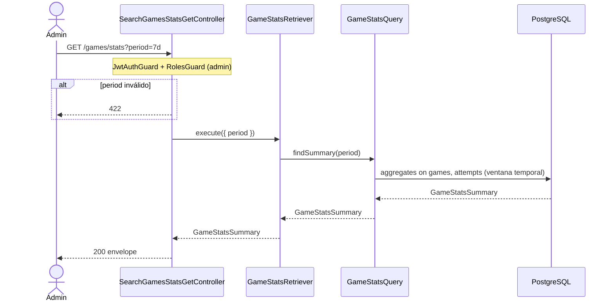

# Admin Game Stats — Diagrama de Secuencia

```mermaid
sequenceDiagram
    actor A as Admin
    participant C as SearchGamesStatsGetController
    participant UC as GameStatsRetriever
    participant Q as GameStatsQuery
    participant DB as PostgreSQL

    A->>C: GET /games/stats?period=7d
    Note over C: JwtAuthGuard + RolesGuard (admin)

    alt period inválido
        C-->>A: 422
    end

    C->>UC: execute({ period })
    UC->>Q: findSummary(period)
    Q->>DB: aggregates on games, attempts (ventana temporal)
    DB-->>Q: GameStatsSummary
    Q-->>UC: GameStatsSummary
    UC-->>C: GameStatsSummary
    C-->>A: 200 envelope
```

## Períodos válidos

`24h | 7d | 15d | 30d | 6m | all` — default `7d`.
