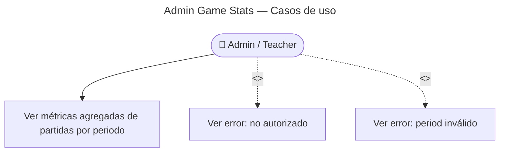

# Admin Game Stats — Casos de Uso

## Reglas de negocio

| Regla | Detalle |
|-------|---------|
| Auth | JWT + rol `admin` |
| Period | Enum en `SearchGamesStatsGetQuery` |
| Datos | Partidas iniciadas/completadas, modos, accuracy agregada |
| Envelope | `{ data: GameStatsSummary, meta }` |
| Uso | Backoffice observability |
