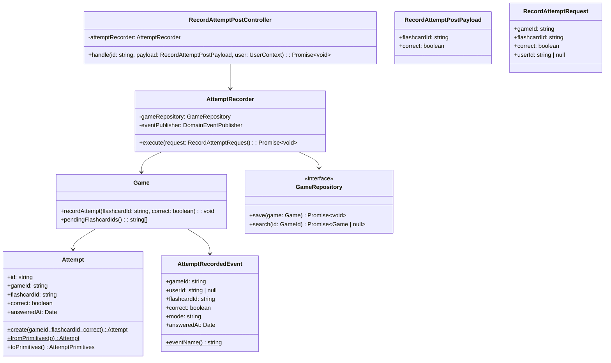

# Attempt — Diagrama de Clases

```mermaid
classDiagram
    class RecordAttemptPostController {
        -attemptRecorder: AttemptRecorder
        +handle(id: string, payload: RecordAttemptPostPayload, user: UserContext): Promise~void~
    }

    class RecordAttemptPostPayload {
        +flashcardId: string
        +correct: boolean
    }

    class AttemptRecorder {
        -gameRepository: GameRepository
        -eventPublisher: DomainEventPublisher
        +execute(request: RecordAttemptRequest): Promise~void~
    }

    class RecordAttemptRequest {
        +gameId: string
        +flashcardId: string
        +correct: boolean
        +userId: string | null
    }

    class Game {
        +recordAttempt(flashcardId: string, correct: boolean): void
        +pendingFlashcardIds(): string[]
    }

    class Attempt {
        +id: string
        +gameId: string
        +flashcardId: string
        +correct: boolean
        +answeredAt: Date
        +create(gameId, flashcardId, correct)$ Attempt
        +fromPrimitives(p)$ Attempt
        +toPrimitives() AttemptPrimitives
    }

    class AttemptRecordedEvent {
        +eventName()$ string
        +gameId: string
        +userId: string | null
        +flashcardId: string
        +correct: boolean
        +mode: string
        +answeredAt: Date
    }

    class GameRepository {
        <<interface>>
        +save(game: Game) Promise~void~
        +search(id: GameId) Promise~Game | null~
    }

    RecordAttemptPostController --> AttemptRecorder
    AttemptRecorder --> GameRepository
    AttemptRecorder --> Game
    Game --> Attempt
    Game --> AttemptRecordedEvent
```
