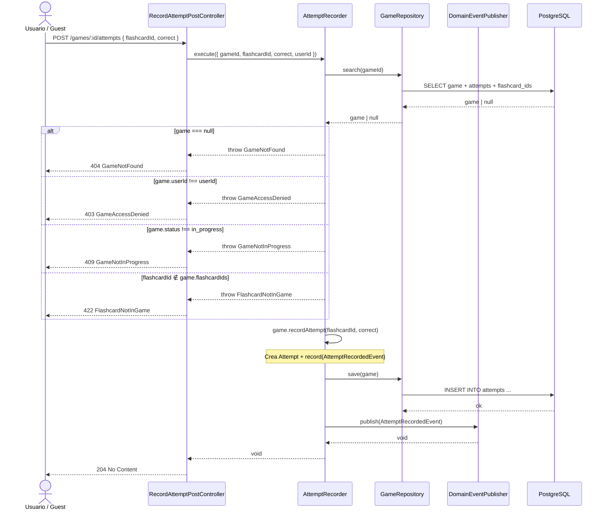

# Attempt — Diagrama de Secuencia

```mermaid
sequenceDiagram
    actor U as Usuario / Guest
    participant C as RecordAttemptPostController
    participant UC as AttemptRecorder
    participant GR as GameRepository
    participant EP as DomainEventPublisher
    participant DB as PostgreSQL

    U->>C: POST /games/:id/attempts { flashcardId, correct }
    C->>UC: execute({ gameId, flashcardId, correct, userId })

    UC->>GR: search(gameId)
    GR->>DB: SELECT game + attempts + flashcard_ids
    DB-->>GR: game | null
    GR-->>UC: game | null

    alt game === null
        UC-->>C: throw GameNotFound
        C-->>U: 404 GameNotFound
    else game.userId !== userId
        UC-->>C: throw GameAccessDenied
        C-->>U: 403 GameAccessDenied
    else game.status !== in_progress
        UC-->>C: throw GameNotInProgress
        C-->>U: 409 GameNotInProgress
    else flashcardId ∉ game.flashcardIds
        UC-->>C: throw FlashcardNotInGame
        C-->>U: 422 FlashcardNotInGame
    end

    UC->>UC: game.recordAttempt(flashcardId, correct)
    Note over UC: Crea Attempt + record(AttemptRecordedEvent)

    UC->>GR: save(game)
    GR->>DB: INSERT INTO attempts ...
    DB-->>GR: ok

    UC->>EP: publish(AttemptRecordedEvent)
    EP-->>UC: void

    UC-->>C: void
    C-->>U: 204 No Content
```
