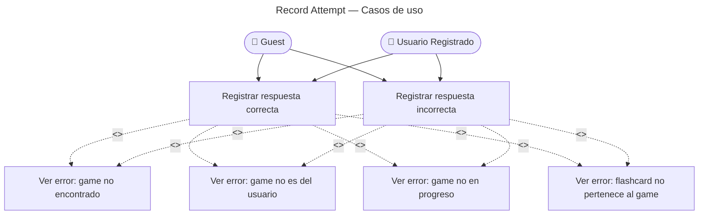

# Attempt — Casos de Uso

## Reglas de negocio

| Regla | Acción |
|---|---|
| Game debe existir | `GameNotFound` (404) |
| Game debe pertenecer al usuario que hace el request | `GameAccessDenied` (403) |
| Game debe estar en estado `in_progress` | `GameNotInProgress` (409) |
| `flashcardId` debe estar en las cartas del game | `FlashcardNotInGame` (422) |
| Cada attempt persiste en tiempo real (no al final) | INSERT inmediato en `attempts` |
| Se emite `AttemptRecordedEvent` por cada attempt | BC Progress lo consume para actualizar stats |
