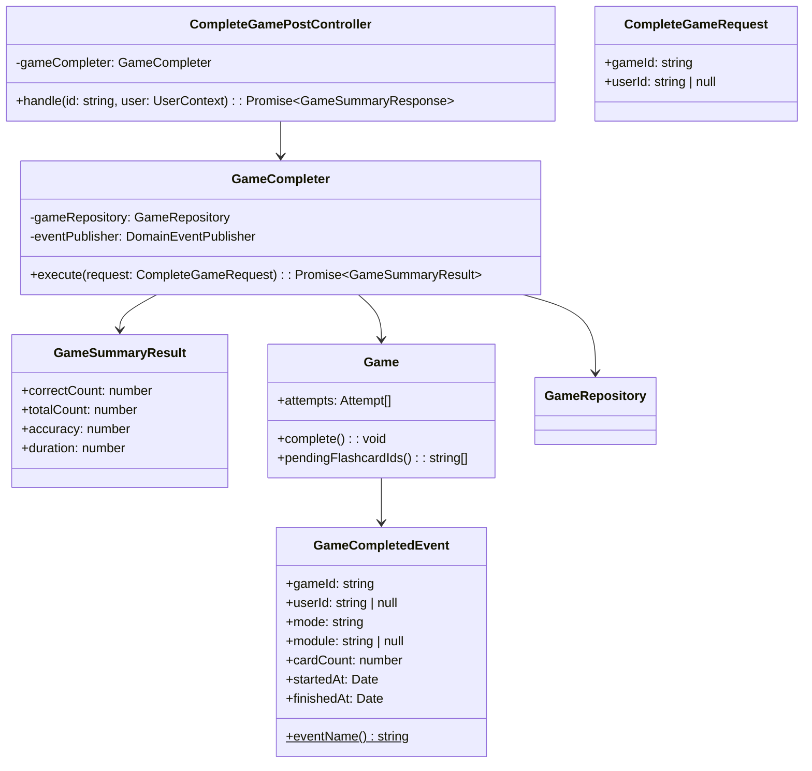

# Complete Game — Diagrama de Clases

```mermaid
classDiagram
    class CompleteGamePostController {
        -gameCompleter: GameCompleter
        +handle(id: string, user: UserContext): Promise~GameSummaryResponse~
    }

    class GameCompleter {
        -gameRepository: GameRepository
        -eventPublisher: DomainEventPublisher
        +execute(request: CompleteGameRequest): Promise~GameSummaryResult~
    }

    class CompleteGameRequest {
        +gameId: string
        +userId: string | null
    }

    class GameSummaryResult {
        +correctCount: number
        +totalCount: number
        +accuracy: number
        +duration: number
    }

    class Game {
        +complete(): void
        +pendingFlashcardIds(): string[]
        +attempts: Attempt[]
    }

    class GameCompletedEvent {
        +eventName()$ string
        +gameId: string
        +userId: string | null
        +mode: string
        +module: string | null
        +cardCount: number
        +startedAt: Date
        +finishedAt: Date
    }

    CompleteGamePostController --> GameCompleter
    GameCompleter --> GameRepository
    GameCompleter --> Game
    Game --> GameCompletedEvent
    GameCompleter --> GameSummaryResult
```
