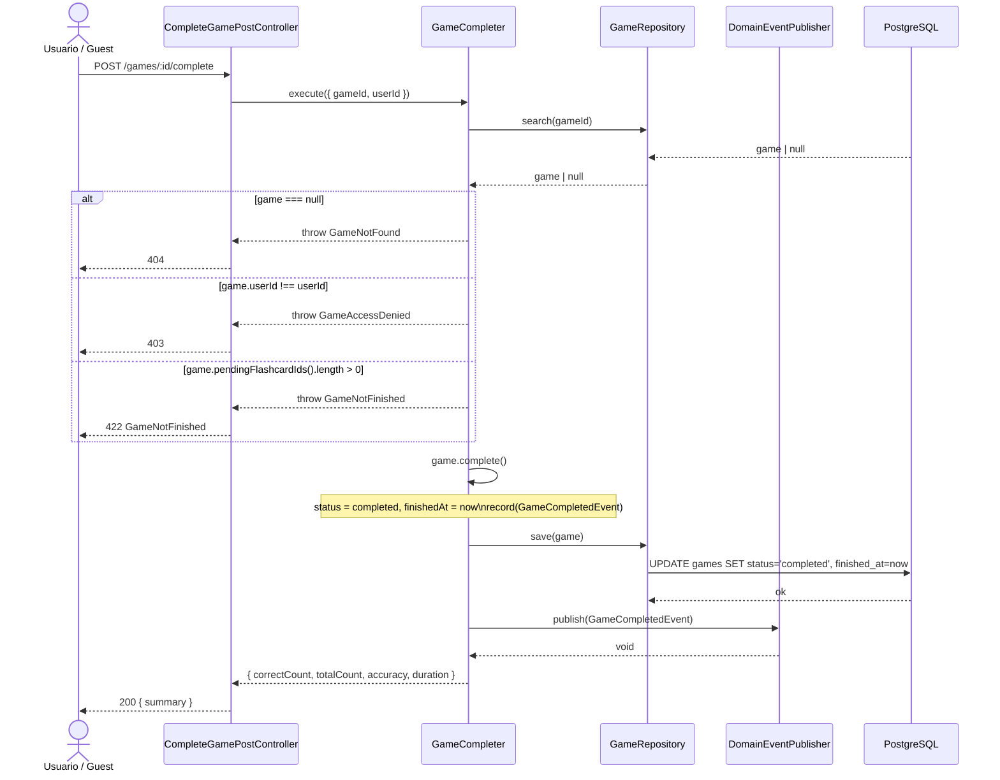
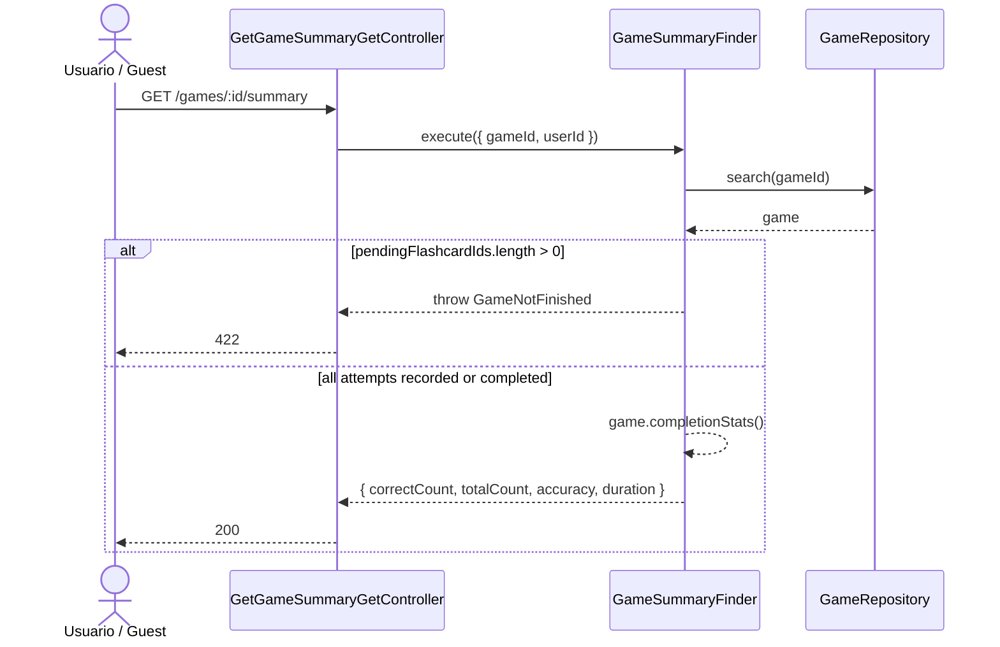

# Complete Game — Diagrama de Secuencia

```mermaid
sequenceDiagram
    actor U as Usuario / Guest
    participant C as CompleteGamePostController
    participant UC as GameCompleter
    participant GR as GameRepository
    participant EP as DomainEventPublisher
    participant DB as PostgreSQL

    U->>C: POST /games/:id/complete
    C->>UC: execute({ gameId, userId })

    UC->>GR: search(gameId)
    DB-->>GR: game | null
    GR-->>UC: game | null

    alt game === null
        UC-->>C: throw GameNotFound
        C-->>U: 404
    else game.userId !== userId
        UC-->>C: throw GameAccessDenied
        C-->>U: 403
    else game.pendingFlashcardIds().length > 0
        UC-->>C: throw GameNotFinished
        C-->>U: 422 GameNotFinished
    end

    UC->>UC: game.complete()
    Note over UC: status = completed, finishedAt = now\nrecord(GameCompletedEvent)

    UC->>GR: save(game)
    GR->>DB: UPDATE games SET status='completed', finished_at=now
    DB-->>GR: ok

    UC->>EP: publish(GameCompletedEvent)
    EP-->>UC: void

    UC-->>C: { correctCount, totalCount, accuracy, duration }
    C-->>U: 200 { summary }
```

## GET Summary — recuperación de resumen

```mermaid
sequenceDiagram
    actor U as Usuario / Guest
    participant C as GetGameSummaryGetController
    participant UC as GameSummaryFinder
    participant GR as GameRepository

    U->>C: GET /games/:id/summary
    C->>UC: execute({ gameId, userId })
    UC->>GR: search(gameId)
    GR-->>UC: game

    alt pendingFlashcardIds.length > 0
        UC-->>C: throw GameNotFinished
        C-->>U: 422
    else all attempts recorded or completed
        UC-->>UC: game.completionStats()
        UC-->>C: { correctCount, totalCount, accuracy, duration }
        C-->>U: 200
    end
```
