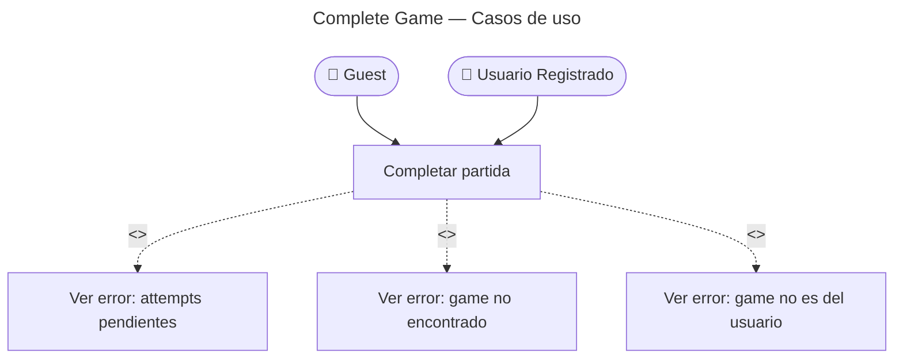

# Complete Game — Casos de Uso

## Reglas de negocio

| Regla | Acción |
|---|---|
| Todas las flashcards deben tener attempt registrado | `GameNotFinished` (422) |
| Game debe pertenecer al usuario | `GameAccessDenied` (403) |
| Se emite `GameCompletedEvent` | BC Progress recalcula `ModuleProgress`; BC Identity evalúa streak |
| Retorna resumen: correctas, total, accuracy, duración | Calculado en memoria desde `game.attempts` |
