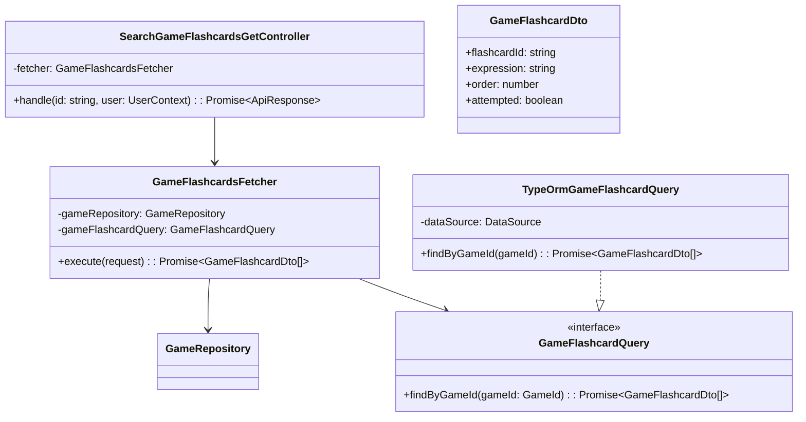

# Game Flashcards — Diagrama de Clases

```mermaid
classDiagram
    class SearchGameFlashcardsGetController {
        -fetcher: GameFlashcardsFetcher
        +handle(id: string, user: UserContext): Promise~ApiResponse~
    }

    class GameFlashcardsFetcher {
        -gameRepository: GameRepository
        -gameFlashcardQuery: GameFlashcardQuery
        +execute(request): Promise~GameFlashcardDto[]~
    }

    class GameFlashcardQuery {
        <<interface>>
        +findByGameId(gameId: GameId): Promise~GameFlashcardDto[]~
    }

    class TypeOrmGameFlashcardQuery {
        -dataSource: DataSource
        +findByGameId(gameId): Promise~GameFlashcardDto[]~
    }

    class GameFlashcardDto {
        +flashcardId: string
        +expression: string
        +order: number
        +attempted: boolean
    }

    SearchGameFlashcardsGetController --> GameFlashcardsFetcher
    GameFlashcardsFetcher --> GameRepository
    GameFlashcardsFetcher --> GameFlashcardQuery
    TypeOrmGameFlashcardQuery ..|> GameFlashcardQuery
```
