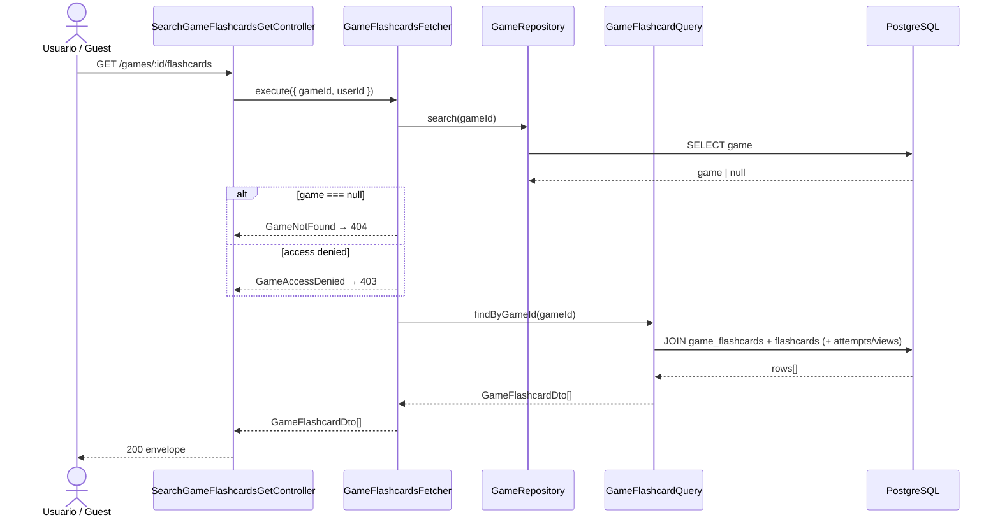

# Game Flashcards — Diagrama de Secuencia

## Reglas

| Regla | Detalle |
|-------|---------|
| Auth | JWT o guest |
| Ownership | Misma regla que otros endpoints de game |
| Orden | Respeta `order` en `game_flashcards` |
| `attempted` | true si hay attempt (game) o view (study) registrado |
