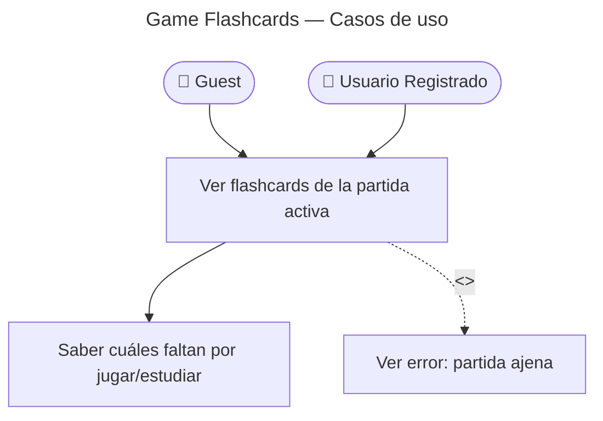

# Game Flashcards — Casos de Uso

## Reglas de negocio

| Regla | Detalle |
|-------|---------|
| Auth | JWT o guest token |
| Modos | Funciona en `game` y `study` |
| Envelope | `{ data: GameFlashcardDto[] }` |
| Cliente | Usado en UI de partida para progreso por carta |
