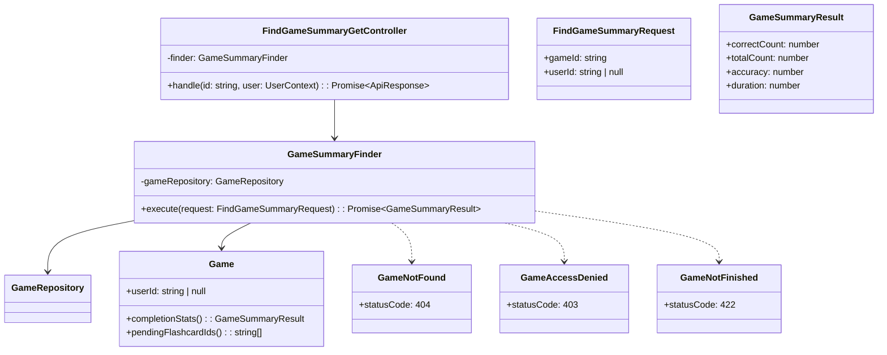

# Game Summary — Diagrama de Clases

```mermaid
classDiagram
    class FindGameSummaryGetController {
        -finder: GameSummaryFinder
        +handle(id: string, user: UserContext): Promise~ApiResponse~
    }

    class GameSummaryFinder {
        -gameRepository: GameRepository
        +execute(request: FindGameSummaryRequest): Promise~GameSummaryResult~
    }

    class FindGameSummaryRequest {
        +gameId: string
        +userId: string | null
    }

    class GameSummaryResult {
        +correctCount: number
        +totalCount: number
        +accuracy: number
        +duration: number
    }

    class Game {
        +completionStats(): GameSummaryResult
        +pendingFlashcardIds(): string[]
        +userId: string | null
    }

    class GameNotFound {
        +statusCode: 404
    }

    class GameAccessDenied {
        +statusCode: 403
    }

    class GameNotFinished {
        +statusCode: 422
    }

    FindGameSummaryGetController --> GameSummaryFinder
    GameSummaryFinder --> GameRepository
    GameSummaryFinder --> Game
    GameSummaryFinder ..> GameNotFound
    GameSummaryFinder ..> GameAccessDenied
    GameSummaryFinder ..> GameNotFinished
```
