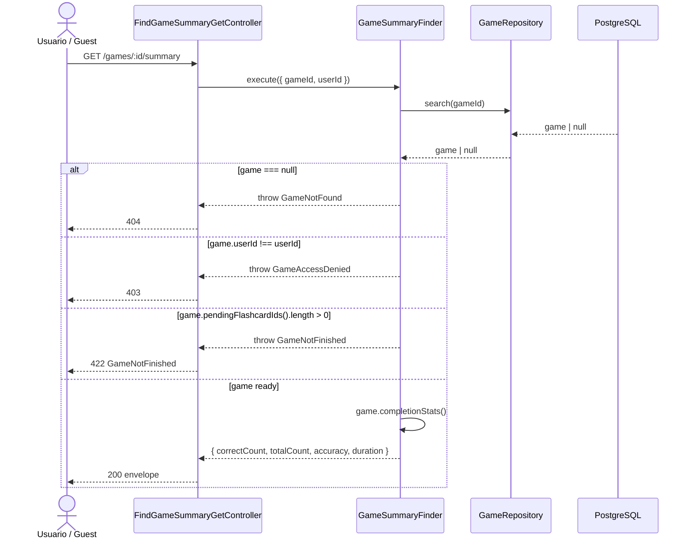

# Game Summary — Diagrama de Secuencia

## Diferencia con POST complete

| Aspecto | GET summary | POST complete |
|---------|-------------|---------------|
| Mutación | Solo lectura | Marca `status=completed` |
| Evento | No publica | Publica `GameCompleted` |
| Cuándo | Recuperar stats sin cerrar partida* | Cierre oficial de partida |

\* Si quedan flashcards pendientes → 422 en ambos casos para summary; complete también valida antes de mutar.
