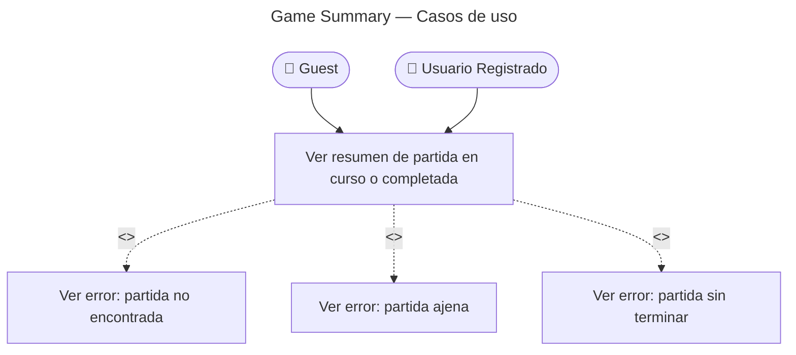

# Game Summary — Casos de Uso

## Reglas de negocio

| Regla | Detalle |
|-------|---------|
| Auth | JWT o guest token |
| Ownership | `game.userId` debe coincidir con caller (null solo guest anónimo) |
| Pendientes | Si hay flashcards sin intento/vista → 422 `GameNotFinished` |
| Stats | `accuracy = correctCount / totalCount`; `duration` en segundos |
| Envelope | `{ data: GameSummaryResult, meta }` |
