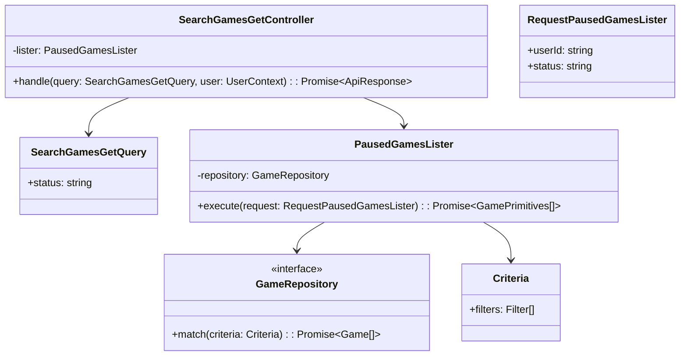

# List Paused Games — Diagrama de Clases

```mermaid
classDiagram
    class SearchGamesGetController {
        -lister: PausedGamesLister
        +handle(query: SearchGamesGetQuery, user: UserContext): Promise~ApiResponse~
    }

    class SearchGamesGetQuery {
        +status: string
    }

    class PausedGamesLister {
        -repository: GameRepository
        +execute(request: RequestPausedGamesLister): Promise~GamePrimitives[]~
    }

    class RequestPausedGamesLister {
        +userId: string
        +status: string
    }

    class GameRepository {
        <<interface>>
        +match(criteria: Criteria): Promise~Game[]~
    }

    class Criteria {
        +filters: Filter[]
    }

    SearchGamesGetController --> PausedGamesLister
    SearchGamesGetController --> SearchGamesGetQuery
    PausedGamesLister --> GameRepository
    PausedGamesLister --> Criteria
```
