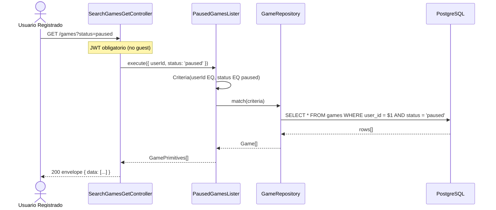

# List Paused Games — Diagrama de Secuencia

## Reglas

| Regla | Detalle |
|-------|---------|
| Auth | Solo usuarios registrados |
| Filtro | `status=paused` en query string |
| Límite pausados | Máx. 5 simultáneos — validado en `GamePauser`, no en listado |
| Respuesta | Array de partidas con metadata (module, cardCount, startedAt, …) |
