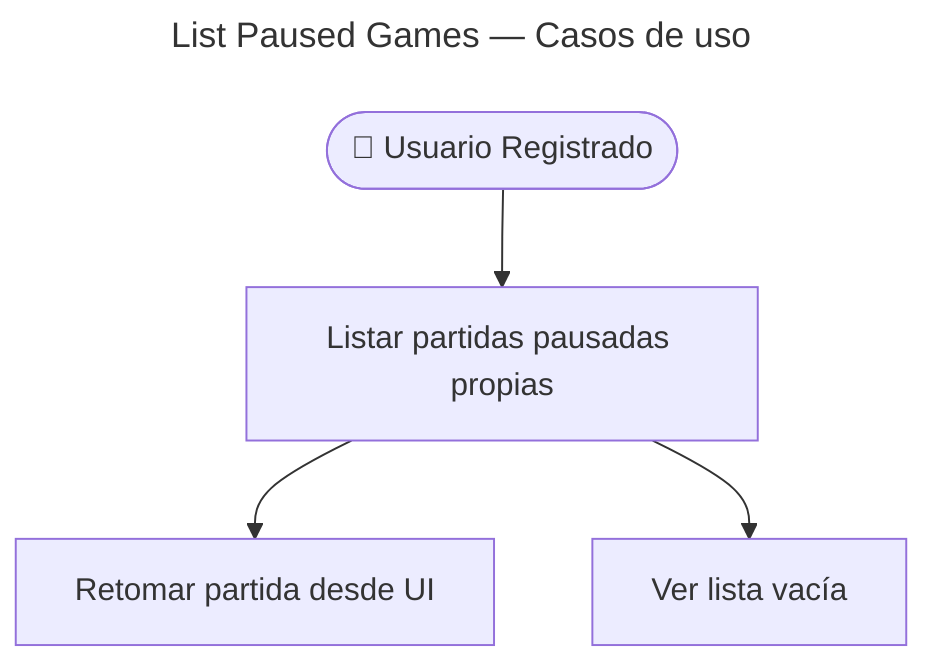

# List Paused Games — Casos de Uso

## Reglas de negocio

| Regla | Detalle |
|-------|---------|
| Auth | JWT — guest no puede pausar ni listar |
| Query | `status=paused` requerido para este flujo |
| Orden | Por `startedAt` descendente (impl en repository) |
| Envelope | `{ data: GamePrimitives[] }` |
| Relacionado | Resume vía [resume/](./../resume/) |
