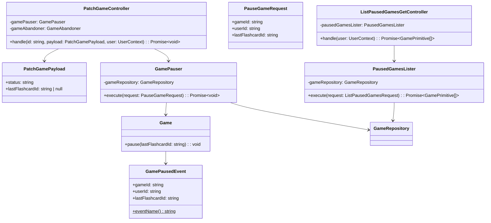

# Pause Game — Diagrama de Clases

```mermaid
classDiagram
    class PatchGameController {
        -gamePauser: GamePauser
        -gameAbandoner: GameAbandoner
        +handle(id: string, payload: PatchGamePayload, user: UserContext): Promise~void~
    }

    class PatchGamePayload {
        +status: string
        +lastFlashcardId: string | null
    }

    class GamePauser {
        -gameRepository: GameRepository
        +execute(request: PauseGameRequest): Promise~void~
    }

    class PauseGameRequest {
        +gameId: string
        +userId: string
        +lastFlashcardId: string
    }

    class PausedGamesLister {
        -gameRepository: GameRepository
        +execute(request: ListPausedGamesRequest): Promise~GamePrimitive[]~
    }

    class ListPausedGamesGetController {
        -pausedGamesLister: PausedGamesLister
        +handle(user: UserContext): Promise~GamePrimitive[]~
    }

    class Game {
        +pause(lastFlashcardId: string): void
    }

    class GamePausedEvent {
        +eventName()$ string
        +gameId: string
        +userId: string
        +lastFlashcardId: string
    }

    PatchGameController --> GamePauser
    PatchGameController --> PatchGamePayload
    GamePauser --> GameRepository
    GamePauser --> Game
    Game --> GamePausedEvent
    ListPausedGamesGetController --> PausedGamesLister
    PausedGamesLister --> GameRepository
```
