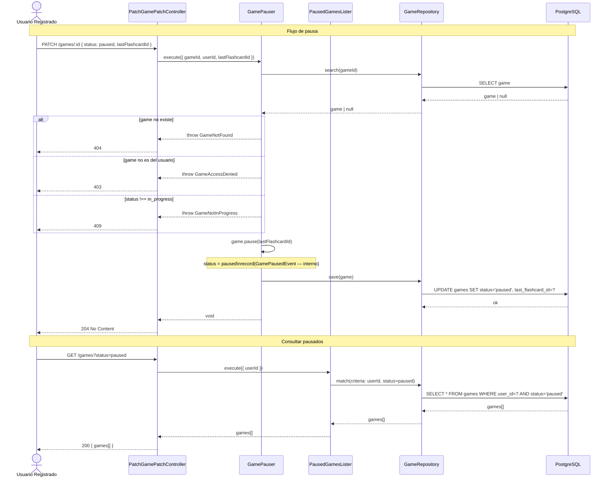

# Pause Game — Diagrama de Secuencia

```mermaid
sequenceDiagram
    actor U as Usuario Registrado
    participant C as PatchGamePatchController
    participant UC as GamePauser
    participant LUC as PausedGamesLister
    participant GR as GameRepository
    participant DB as PostgreSQL

    note over U,DB: Flujo de pausa

    U->>C: PATCH /games/:id { status: paused, lastFlashcardId }
    C->>UC: execute({ gameId, userId, lastFlashcardId })

    UC->>GR: search(gameId)
    GR->>DB: SELECT game
    DB-->>GR: game | null
    GR-->>UC: game | null

    alt game no existe
        UC-->>C: throw GameNotFound
        C-->>U: 404
    else game no es del usuario
        UC-->>C: throw GameAccessDenied
        C-->>U: 403
    else status !== in_progress
        UC-->>C: throw GameNotInProgress
        C-->>U: 409
    end

    UC->>UC: game.pause(lastFlashcardId)
    Note over UC: status = paused\nrecord(GamePausedEvent — interno)

    UC->>GR: save(game)
    GR->>DB: UPDATE games SET status='paused', last_flashcard_id=?
    DB-->>GR: ok

    UC-->>C: void
    C-->>U: 204 No Content

    note over U,DB: Consultar pausados

    U->>C: GET /games?status=paused
    C->>LUC: execute({ userId })
    LUC->>GR: match(criteria: userId, status=paused)
    GR->>DB: SELECT * FROM games WHERE user_id=? AND status='paused'
    DB-->>GR: games[]
    GR-->>LUC: games[]
    LUC-->>C: games[]
    C-->>U: 200 { games[] }
```
