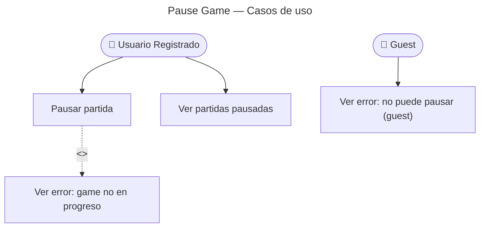

# Pause Game — Casos de Uso

## Reglas de negocio

| Regla | Acción |
|---|---|
| Solo usuarios registrados pueden pausar | Guest → 403 (guard de rol en controller) |
| Game debe estar `in_progress` | `GameNotInProgress` (409) |
| Se persiste `lastFlashcardId` | Permite retomar desde la última carta |
| `GamePausedEvent` es INTERNO | No se publica al AMQP — ningún BC lo consume |
| Máximo 5 games pausados | Verificado al INICIAR, no al pausar |
