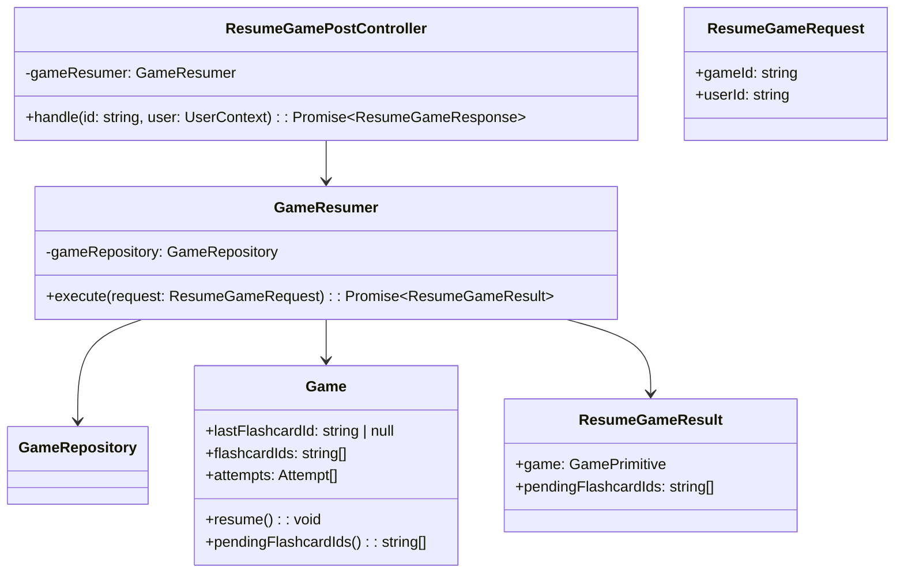

# Resume Game — Diagrama de Clases

```mermaid
classDiagram
    class ResumeGamePostController {
        -gameResumer: GameResumer
        +handle(id: string, user: UserContext): Promise~ResumeGameResponse~
    }

    class GameResumer {
        -gameRepository: GameRepository
        +execute(request: ResumeGameRequest): Promise~ResumeGameResult~
    }

    class ResumeGameRequest {
        +gameId: string
        +userId: string
    }

    class ResumeGameResult {
        +game: GamePrimitive
        +pendingFlashcardIds: string[]
    }

    class Game {
        +resume(): void
        +pendingFlashcardIds(): string[]
        +lastFlashcardId: string | null
        +flashcardIds: string[]
        +attempts: Attempt[]
    }

    ResumeGamePostController --> GameResumer
    GameResumer --> GameRepository
    GameResumer --> Game
    GameResumer --> ResumeGameResult
```
