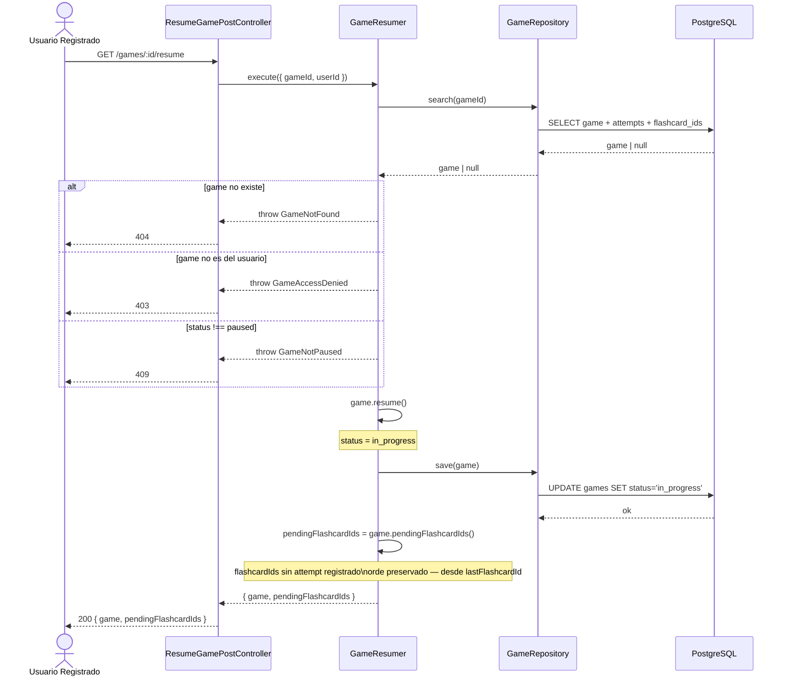

# Resume Game — Diagrama de Secuencia

```mermaid
sequenceDiagram
    actor U as Usuario Registrado
    participant C as ResumeGamePostController
    participant UC as GameResumer
    participant GR as GameRepository
    participant DB as PostgreSQL

    U->>C: GET /games/:id/resume
    C->>UC: execute({ gameId, userId })

    UC->>GR: search(gameId)
    GR->>DB: SELECT game + attempts + flashcard_ids
    DB-->>GR: game | null
    GR-->>UC: game | null

    alt game no existe
        UC-->>C: throw GameNotFound
        C-->>U: 404
    else game no es del usuario
        UC-->>C: throw GameAccessDenied
        C-->>U: 403
    else status !== paused
        UC-->>C: throw GameNotPaused
        C-->>U: 409
    end

    UC->>UC: game.resume()
    Note over UC: status = in_progress

    UC->>GR: save(game)
    GR->>DB: UPDATE games SET status='in_progress'
    DB-->>GR: ok

    UC->>UC: pendingFlashcardIds = game.pendingFlashcardIds()
    Note over UC: flashcardIds sin attempt registrado\norde preservado — desde lastFlashcardId

    UC-->>C: { game, pendingFlashcardIds }
    C-->>U: 200 { game, pendingFlashcardIds }
```
