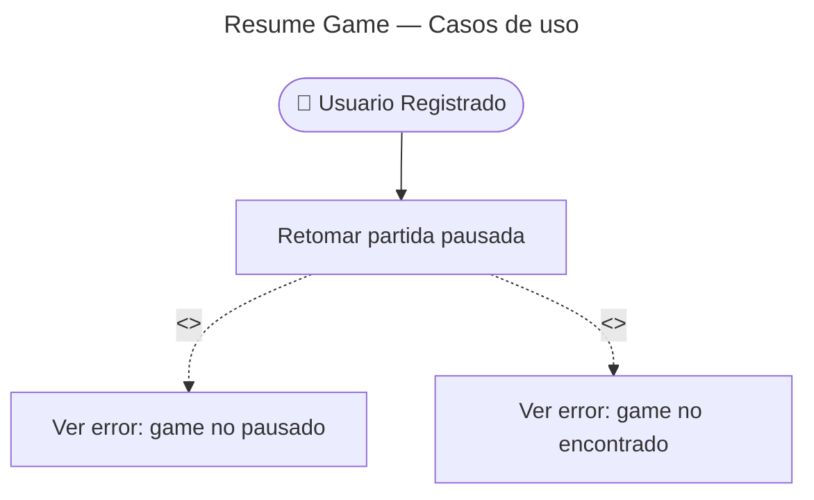

# Resume Game — Casos de Uso

## Reglas de negocio

| Regla | Acción |
|---|---|
| Solo usuarios registrados pueden retomar | Endpoint protegido con rol `user` |
| Game debe estar en estado `paused` | `GameNotPaused` (409) |
| `pendingFlashcardIds` = flashcardIds sin attempt | Calculado en memoria desde `game.attempts` |
| El game vuelve a `in_progress` | UPDATE en DB |
| El cliente muestra las cartas pendientes en orden | Preservando el orden original de `game_flashcards` |
