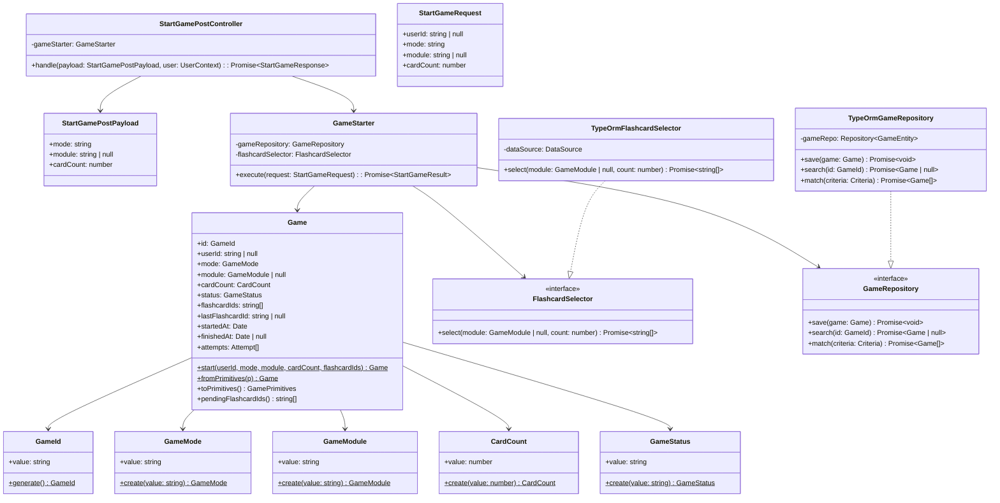

# Start Game — Diagrama de Clases

```mermaid
classDiagram
    class StartGamePostController {
        -gameStarter: GameStarter
        +handle(payload: StartGamePostPayload, user: UserContext): Promise~StartGameResponse~
    }

    class StartGamePostPayload {
        +mode: string
        +module: string | null
        +cardCount: number
    }

    class GameStarter {
        -gameRepository: GameRepository
        -flashcardSelector: FlashcardSelector
        +execute(request: StartGameRequest): Promise~StartGameResult~
    }

    class StartGameRequest {
        +userId: string | null
        +mode: string
        +module: string | null
        +cardCount: number
    }

    class Game {
        +id: GameId
        +userId: string | null
        +mode: GameMode
        +module: GameModule | null
        +cardCount: CardCount
        +status: GameStatus
        +flashcardIds: string[]
        +lastFlashcardId: string | null
        +startedAt: Date
        +finishedAt: Date | null
        +attempts: Attempt[]
        +start(userId, mode, module, cardCount, flashcardIds)$ Game
        +fromPrimitives(p)$ Game
        +toPrimitives() GamePrimitives
        +pendingFlashcardIds() string[]
    }

    class GameId {
        +value: string
        +generate()$ GameId
    }

    class GameMode {
        +value: string
        +create(value: string)$ GameMode
    }

    class GameModule {
        +value: string
        +create(value: string)$ GameModule
    }

    class CardCount {
        +value: number
        +create(value: number)$ CardCount
    }

    class GameStatus {
        +value: string
        +create(value: string)$ GameStatus
    }

    class FlashcardSelector {
        <<interface>>
        +select(module: GameModule | null, count: number) Promise~string[]~
    }

    class GameRepository {
        <<interface>>
        +save(game: Game) Promise~void~
        +search(id: GameId) Promise~Game | null~
        +match(criteria: Criteria) Promise~Game[]~
    }

    class TypeOrmFlashcardSelector {
        -dataSource: DataSource
        +select(module: GameModule | null, count: number) Promise~string[]~
    }

    class TypeOrmGameRepository {
        -gameRepo: Repository~GameEntity~
        +save(game: Game) Promise~void~
        +search(id: GameId) Promise~Game | null~
        +match(criteria: Criteria) Promise~Game[]~
    }

    StartGamePostController --> GameStarter
    StartGamePostController --> StartGamePostPayload
    GameStarter --> Game
    GameStarter --> GameRepository
    GameStarter --> FlashcardSelector
    Game --> GameId
    Game --> GameMode
    Game --> GameModule
    Game --> CardCount
    Game --> GameStatus
    TypeOrmFlashcardSelector ..|> FlashcardSelector
    TypeOrmGameRepository ..|> GameRepository
```
