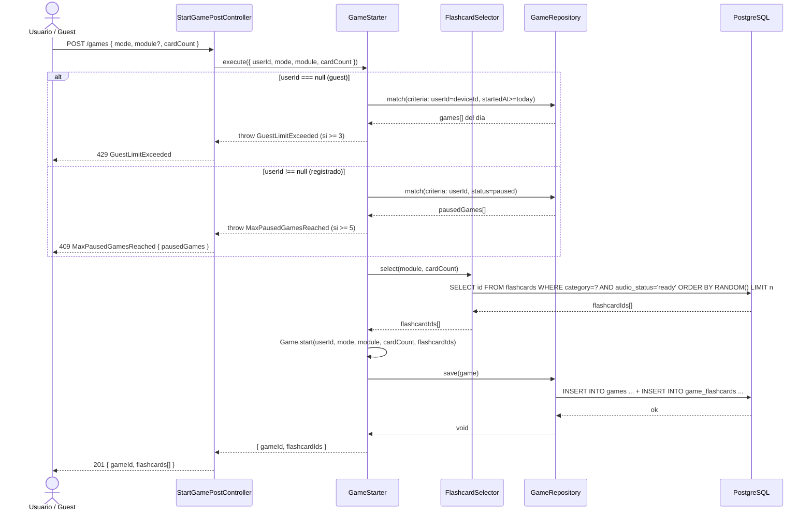

# Start Game — Diagrama de Secuencia

```mermaid
sequenceDiagram
    actor U as Usuario / Guest
    participant C as StartGamePostController
    participant UC as GameStarter
    participant FS as FlashcardSelector
    participant GR as GameRepository
    participant DB as PostgreSQL

    U->>C: POST /games { mode, module?, cardCount }
    C->>UC: execute({ userId, mode, module, cardCount })

    alt userId === null (guest)
        UC->>GR: match(criteria: userId=deviceId, startedAt>=today)
        GR-->>UC: games[] del día
        UC-->>C: throw GuestLimitExceeded (si >= 3)
        C-->>U: 429 GuestLimitExceeded
    else userId !== null (registrado)
        UC->>GR: match(criteria: userId, status=paused)
        GR-->>UC: pausedGames[]
        UC-->>C: throw MaxPausedGamesReached (si >= 5)
        C-->>U: 409 MaxPausedGamesReached { pausedGames }
    end

    UC->>FS: select(module, cardCount)
    FS->>DB: SELECT id FROM flashcards WHERE category=? AND audio_status='ready' ORDER BY RANDOM() LIMIT n
    DB-->>FS: flashcardIds[]
    FS-->>UC: flashcardIds[]

    UC->>UC: Game.start(userId, mode, module, cardCount, flashcardIds)
    UC->>GR: save(game)
    GR->>DB: INSERT INTO games ... + INSERT INTO game_flashcards ...
    DB-->>GR: ok
    GR-->>UC: void

    UC-->>C: { gameId, flashcardIds }
    C-->>U: 201 { gameId, flashcards[] }
```
