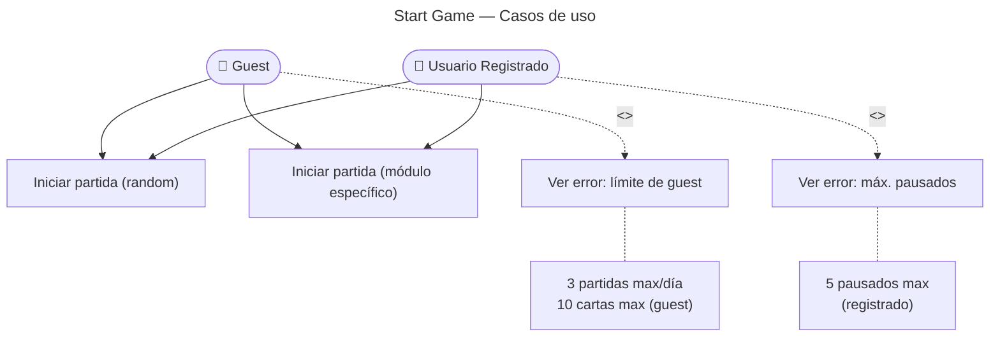

# Start Game — Casos de Uso

## Reglas de negocio

| Regla | Actor | Acción |
|---|---|---|
| Máximo 3 partidas de 10 cartas por día | Guest | `GuestLimitExceeded` (429) |
| Máximo 5 games pausados simultáneos | User | `MaxPausedGamesReached` (409) con lista |
| `module: null` = selección aleatoria de todos los módulos | Todos | `FlashcardSelector.select(null, count)` |
| Solo flashcards con `audio_status: ready` se seleccionan | Sistema | Filtro en `TypeOrmFlashcardSelector` |
| La selección es aleatoria | Sistema | `ORDER BY RANDOM()` |
