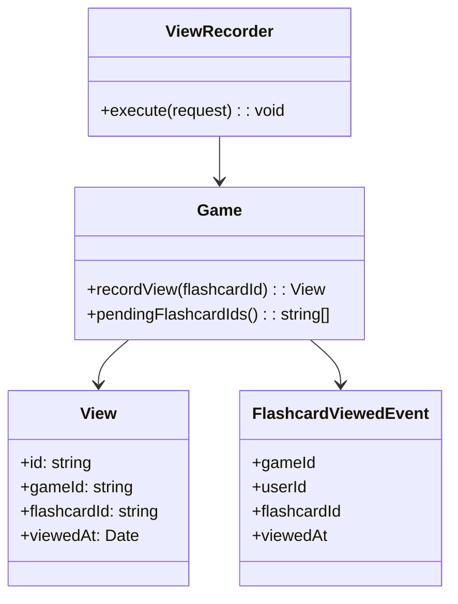

# Record View — Clases

```mermaid
classDiagram
    class Game {
        +recordView(flashcardId): View
        +pendingFlashcardIds(): string[]
    }
    class View {
        +id: string
        +gameId: string
        +flashcardId: string
        +viewedAt: Date
    }
    class ViewRecorder {
        +execute(request): void
    }
    class FlashcardViewedEvent {
        +gameId
        +userId
        +flashcardId
        +viewedAt
    }

    Game --> View
    ViewRecorder --> Game
    Game --> FlashcardViewedEvent
```
