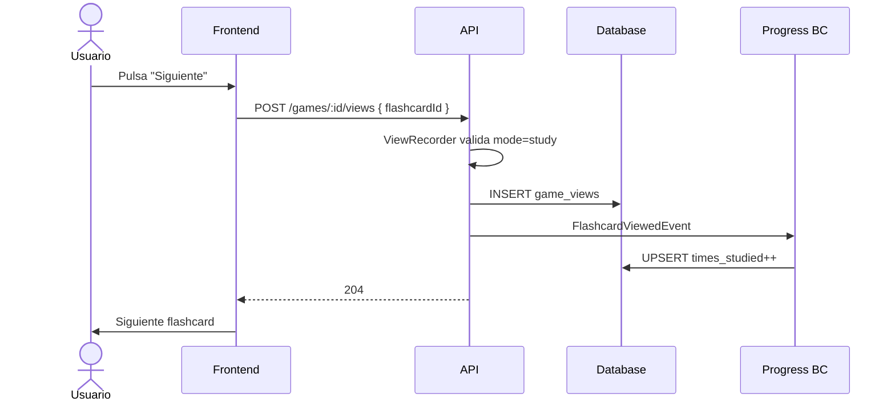

# Record View — Secuencia

```mermaid
sequenceDiagram
    actor U as Usuario
    participant FE as Frontend
    participant API as API
    participant DB as Database
    participant Progress as Progress BC

    U->>FE: Pulsa "Siguiente"
    FE->>API: POST /games/:id/views { flashcardId }
    API->>API: ViewRecorder valida mode=study
    API->>DB: INSERT game_views
    API->>Progress: FlashcardViewedEvent
    Progress->>DB: UPSERT times_studied++
    API-->>FE: 204
    FE->>U: Siguiente flashcard
```
