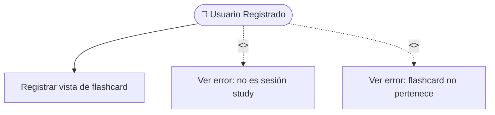

# Record View — Casos de uso

| Regla | Acción |
| ----- | ------ |
| Solo `mode = study` | `ViewRequiresStudyMode` |
| Flashcard ∈ game | `FlashcardNotInGame` |
| Game `in_progress` | `GameNotInProgress` |
| Emite evento | `FlashcardViewedEvent` → Progress |
