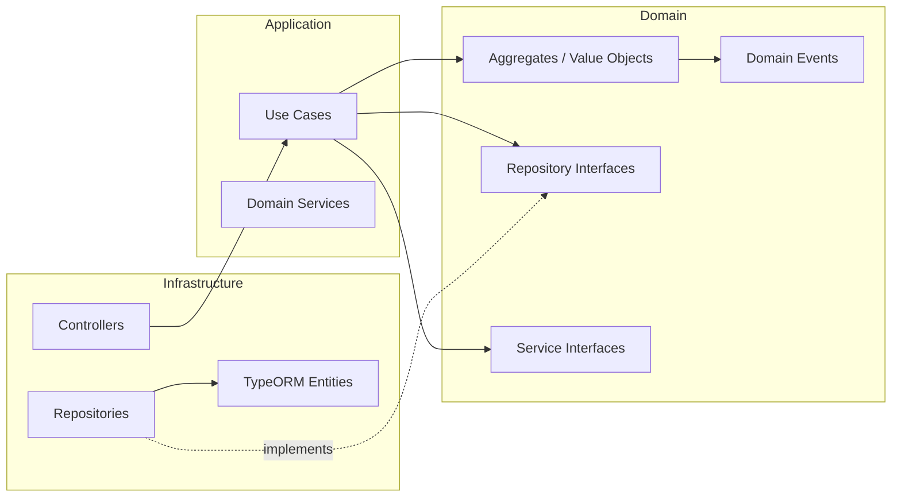

# Identity BC — Documentación

> Bounded Context responsable de la autenticación y gestión de identidad de usuarios en ididntcatchthat.

## Flujos de negocio

Cada flujo tiene 3 diagramas: secuencia, clases y casos de uso.

| Flujo | Descripción | Diagramas |
|---|---|---|
| [Guest](./guest/) | Token temporal para usuarios no registrados | [Secuencia](./guest/sequence.md) · [Clases](./guest/classes.md) · [Casos de uso](./guest/usecases.md) |
| [Register](./register/) | Registro con email + password | [Secuencia](./register/sequence.md) · [Clases](./register/classes.md) · [Casos de uso](./register/usecases.md) |
| [Login](./login/) | Autenticación con email + password | [Secuencia](./login/sequence.md) · [Clases](./login/classes.md) · [Casos de uso](./login/usecases.md) |
| [Refresh](./refresh/) | Renovación de access token con rotación y reuse detection | [Secuencia](./refresh/sequence.md) · [Clases](./refresh/classes.md) · [Casos de uso](./refresh/usecases.md) |
| [Logout](./logout/) | Cierre de sesión — revoca refresh token del dispositivo | [Secuencia](./logout/sequence.md) · [Clases](./logout/classes.md) · [Casos de uso](./logout/usecases.md) |
| [Google OAuth](./google-oauth/) | Login / registro mediante Google OAuth2 | [Secuencia](./google-oauth/sequence.md) · [Clases](./google-oauth/classes.md) · [Casos de uso](./google-oauth/usecases.md) |
| [Migrate Guest](./migrate-guest/) | Migración del progreso guest a cuenta registrada | [Secuencia](./migrate-guest/sequence.md) · [Clases](./migrate-guest/classes.md) · [Casos de uso](./migrate-guest/usecases.md) |

---

## Mapa de endpoints

| Método | Ruta | Flujo | Auth |
|---|---|---|---|
| `POST` | `/auth/guest` | [Guest](./guest/) | — |
| `POST` | `/auth/register` | [Register](./register/) | — |
| `POST` | `/auth/login` | [Login](./login/) | — |
| `POST` | `/auth/refresh` | [Refresh](./refresh/) | Cookie `userSession` |
| `POST` | `/auth/logout` | [Logout](./logout/) | Bearer JWT |
| `GET` | `/auth/google` | [Google OAuth](./google-oauth/) | — |
| `GET` | `/auth/google/callback` | [Google OAuth](./google-oauth/) | Google OAuth2 |
| `POST` | `/auth/migrate-guest` | [Migrate Guest](./migrate-guest/) | Bearer JWT |

---

## Arquitectura general

> **Regla de dependencias**: `Infrastructure` → `Application` → `Domain`. Nunca al revés.

---

## Referencias

- [Spec de autenticación](../../../spec/auth.md)
- [Guía de testing](../../../testing.md)
- [Tasks completados](../../../tasks/auth.md)
