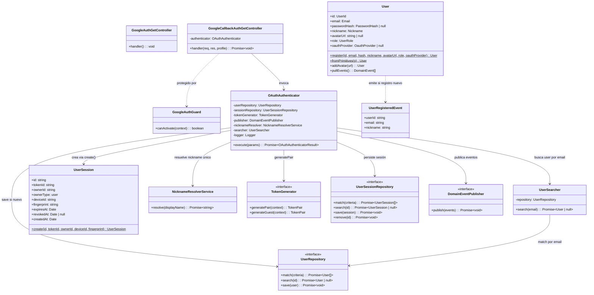

# Google OAuth — Diagrama de Clases

> Artefactos involucrados en `GET /auth/google` y `GET /auth/google/callback`

```mermaid
classDiagram
    class GoogleAuthGetController {
        +handler(): void
    }

    class GoogleCallbackAuthGetController {
        -authenticator: OAuthAuthenticator
        +handler(req, res, profile): Promise~void~
    }

    class GoogleAuthGuard {
        +canActivate(context): boolean
    }

    class OAuthAuthenticator {
        -userRepository: UserRepository
        -sessionRepository: UserSessionRepository
        -tokenGenerator: TokenGenerator
        -publisher: DomainEventPublisher
        -nicknameResolver: NicknameResolverService
        -searcher: UserSearcher
        -logger: Logger
        +execute(params): Promise~OAuthAuthenticatorResult~
    }

    class UserSearcher {
        -repository: UserRepository
        +search(email): Promise~User | null~
    }

    class User {
        +id: UserId
        +email: Email
        +passwordHash: PasswordHash | null
        +nickname: Nickname
        +avatarUrl: string | null
        +role: UserRole
        +oauthProvider: OauthProvider | null
        +register(id, email, hash, nickname, avatarUrl, role, oauthProvider)$ User
        +fromPrimitives(p)$ User
        +addAvatar(url): User
        +pullEvents(): DomainEvent[]
    }

    class UserSession {
        +id: string
        +tokenId: string
        +ownerId: string
        +ownerType: user
        +deviceId: string
        +fingerprint: string
        +expiresAt: Date
        +revokedAt: Date | null
        +createdAt: Date
        +create(id, tokenId, ownerId, deviceId, fingerprint)$ UserSession
    }

    class NicknameResolverService {
        +resolve(displayName): Promise~string~
    }

    class TokenGenerator {
        <<interface>>
        +generatePair(context): TokenPair
        +generateGuest(context): TokenPair
    }

    class UserRepository {
        <<interface>>
        +match(criteria): Promise~User[]~
        +search(id): Promise~User | null~
        +save(user): Promise~void~
    }

    class UserSessionRepository {
        <<interface>>
        +match(criteria): Promise~UserSession[]~
        +search(id): Promise~UserSession | null~
        +save(session): Promise~void~
        +remove(id): Promise~void~
    }

    class DomainEventPublisher {
        <<interface>>
        +publish(events): Promise~void~
    }

    class UserRegisteredEvent {
        +userId: string
        +email: string
        +nickname: string
    }

    GoogleCallbackAuthGetController --> OAuthAuthenticator : invoca
    GoogleCallbackAuthGetController ..> GoogleAuthGuard : protegido por
    OAuthAuthenticator --> UserSearcher : busca user por email
    OAuthAuthenticator --> UserRepository : save si nuevo
    OAuthAuthenticator --> UserSession : crea via create()
    OAuthAuthenticator --> UserSessionRepository : persiste sesión
    OAuthAuthenticator --> TokenGenerator : generatePair
    OAuthAuthenticator --> DomainEventPublisher : publica eventos
    OAuthAuthenticator --> NicknameResolverService : resuelve nickname único
    UserSearcher --> UserRepository : match por email
    User ..> UserRegisteredEvent : emite si registro nuevo
```
