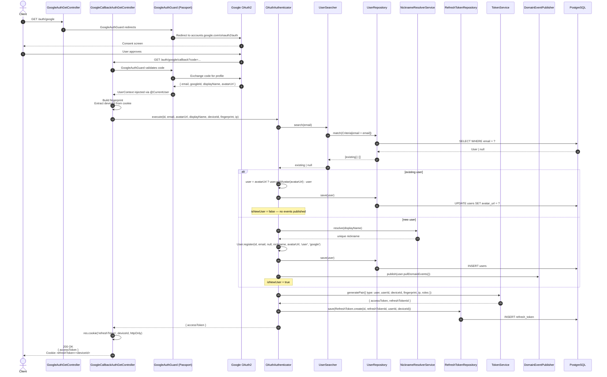

# Google OAuth — Sequence Diagram

Flujo de autenticación con Google. Dos controladores participan:
- `GET /auth/google` → inicia el redirect a Google
- `GET /auth/google/callback` → recibe el callback con el perfil del usuario

