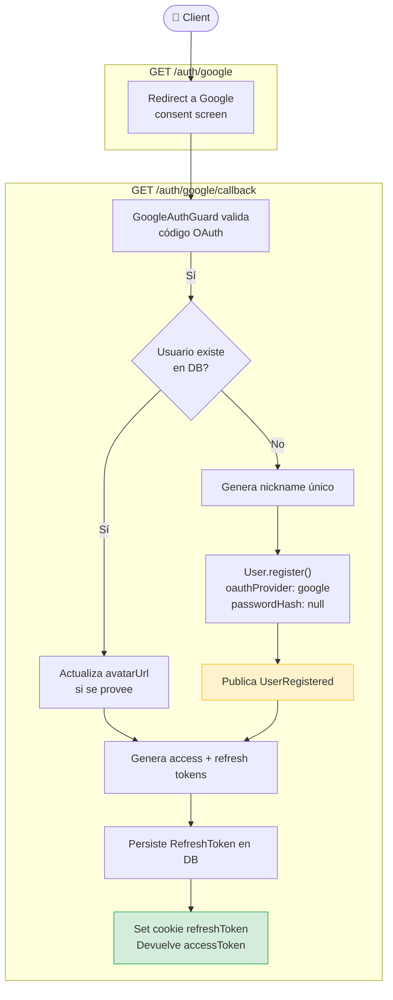

# Google OAuth — Use Case Diagram

## Reglas de negocio

| Regla | Descripción |
|---|---|
| Usuario existente | Si el email ya está en DB → actualizar avatar, no crear nuevo usuario |
| Usuario nuevo | `passwordHash = null`, `oauthProvider = 'google'`, nickname derivado de `displayName` |
| Nickname único | `NicknameResolverService` garantiza unicidad (añade sufijo numérico si colisiona) |
| Evento de dominio | `UserRegistered` solo se publica para usuarios **nuevos** |
| `UserSearcher` | Domain Service que encapsula la búsqueda por email vía `UserRepository.match` |
| Response | Solo devuelve `accessToken` — sin `isNewUser` |
