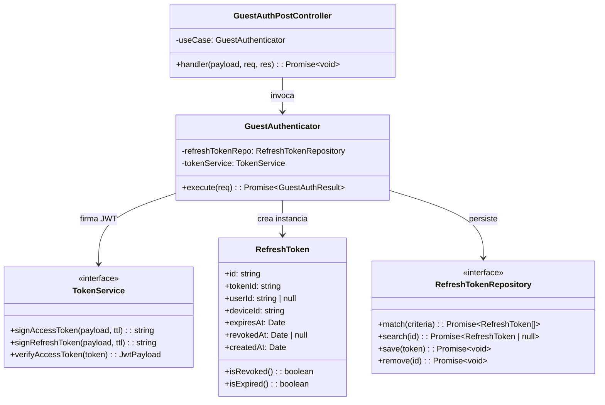

# Guest Auth — Diagrama de Clases

> Artefactos involucrados en `POST /auth/guest`

```mermaid
classDiagram
    class GuestAuthPostController {
        -useCase: GuestAuthenticator
        +handler(payload, req, res): Promise~void~
    }

    class GuestAuthenticator {
        -refreshTokenRepo: RefreshTokenRepository
        -tokenService: TokenService
        +execute(req): Promise~GuestAuthResult~
    }

    class TokenService {
        <<interface>>
        +signAccessToken(payload, ttl): string
        +signRefreshToken(payload, ttl): string
        +verifyAccessToken(token): JwtPayload
    }

    class RefreshToken {
        +id: string
        +tokenId: string
        +userId: string | null
        +deviceId: string
        +expiresAt: Date
        +revokedAt: Date | null
        +createdAt: Date
        +isRevoked(): boolean
        +isExpired(): boolean
    }

    class RefreshTokenRepository {
        <<interface>>
        +match(criteria): Promise~RefreshToken[]~
        +search(id): Promise~RefreshToken | null~
        +save(token): Promise~void~
        +remove(id): Promise~void~
    }

    GuestAuthPostController --> GuestAuthenticator : invoca
    GuestAuthenticator --> TokenService : firma JWT
    GuestAuthenticator --> RefreshToken : crea instancia
    GuestAuthenticator --> RefreshTokenRepository : persiste
```
