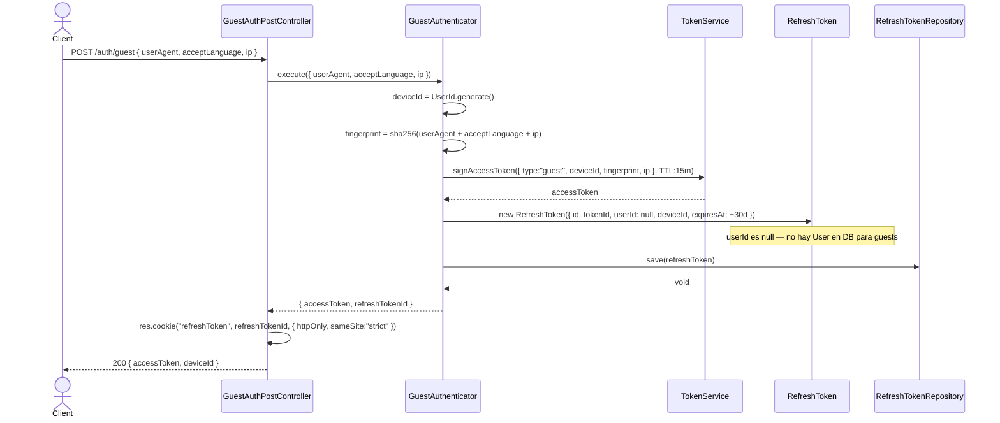

# Guest Auth — Diagrama de Secuencia

> `POST /auth/guest` — controller → use case → domain → persistence

```mermaid
sequenceDiagram
    actor Client
    participant C as GuestAuthPostController
    participant UC as GuestAuthenticator
    participant TS as TokenService
    participant RT as RefreshToken
    participant RTREPO as RefreshTokenRepository

    Client->>C: POST /auth/guest { userAgent, acceptLanguage, ip }
    C->>UC: execute({ userAgent, acceptLanguage, ip })

    UC->>UC: deviceId = UserId.generate()
    UC->>UC: fingerprint = sha256(userAgent + acceptLanguage + ip)

    UC->>TS: signAccessToken({ type:"guest", deviceId, fingerprint, ip }, TTL:15m)
    TS-->>UC: accessToken

    UC->>RT: new RefreshToken({ id, tokenId, userId: null, deviceId, expiresAt: +30d })
    Note over RT: userId es null — no hay User en DB para guests

    UC->>RTREPO: save(refreshToken)
    RTREPO-->>UC: void

    UC-->>C: { accessToken, refreshTokenId }

    C->>C: res.cookie("refreshToken", refreshTokenId, { httpOnly, sameSite:"strict" })
    C-->>Client: 200 { accessToken, deviceId }
```
