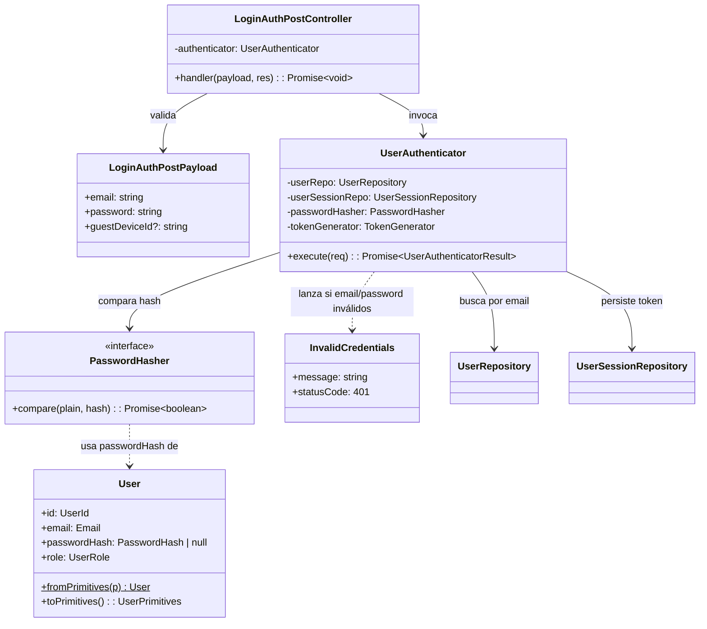

# Login — Diagrama de Clases

> Artefactos involucrados en `POST /auth/login`

```mermaid
classDiagram
    class LoginAuthPostController {
        -authenticator: UserAuthenticator
        +handler(payload, res): Promise~void~
    }

    class LoginAuthPostPayload {
        +email: string
        +password: string
        +guestDeviceId?: string
    }

    class UserAuthenticator {
        -userRepo: UserRepository
        -userSessionRepo: UserSessionRepository
        -passwordHasher: PasswordHasher
        -tokenGenerator: TokenGenerator
        +execute(req): Promise~UserAuthenticatorResult~
    }

    class User {
        +id: UserId
        +email: Email
        +passwordHash: PasswordHash | null
        +role: UserRole
        +fromPrimitives(p)$ User
        +toPrimitives(): UserPrimitives
    }

    class PasswordHasher {
        <<interface>>
        +compare(plain, hash): Promise~boolean~
    }

    class InvalidCredentials {
        +message: string
        +statusCode: 401
    }

    LoginAuthPostController --> LoginAuthPostPayload : valida
    LoginAuthPostController --> UserAuthenticator : invoca
    UserAuthenticator --> UserRepository : busca por email
    UserAuthenticator --> PasswordHasher : compara hash
    UserAuthenticator --> UserSessionRepository : persiste token
    UserAuthenticator ..> InvalidCredentials : lanza si email/password inválidos
    PasswordHasher ..> User : usa passwordHash de
```
