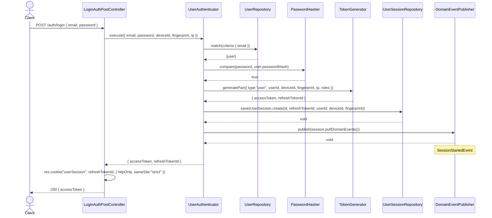
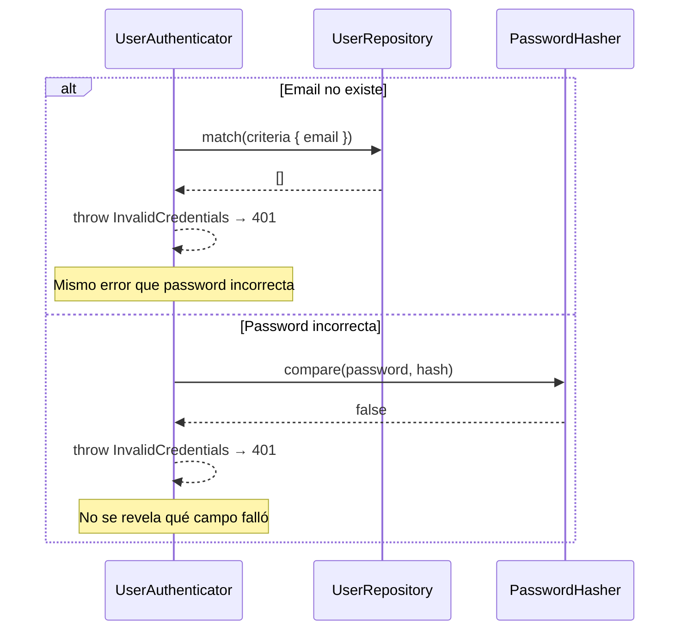

# Login — Diagrama de Secuencia

> `POST /auth/login` — controller → use case → domain → persistence

## Flujo exitoso

```mermaid
sequenceDiagram
    actor Client
    participant C as LoginAuthPostController
    participant UC as UserAuthenticator
    participant UREPO as UserRepository
    participant PH as PasswordHasher
    participant TG as TokenGenerator
    participant RTREPO as UserSessionRepository
    participant EP as DomainEventPublisher

    Client->>C: POST /auth/login { email, password }
    C->>UC: execute({ email, password, deviceId, fingerprint, ip })

    UC->>UREPO: match(criteria { email })
    UREPO-->>UC: [user]

    UC->>PH: compare(password, user.passwordHash)
    PH-->>UC: true

    UC->>TG: generatePair({ type:"user", userId, deviceId, fingerprint, ip, roles })
    TG-->>UC: { accessToken, refreshTokenId }

    UC->>RTREPO: save(UserSession.create(id, refreshTokenId, userId, deviceId, fingerprint))
    RTREPO-->>UC: void

    UC->>EP: publish(session.pullDomainEvents())
    EP-->>UC: void
    Note over EP: SessionStartedEvent

    UC-->>C: { accessToken, refreshTokenId }
    C->>C: res.cookie("userSession", refreshTokenId, { httpOnly, sameSite:"strict" })
    C-->>Client: 200 { accessToken }
```

## Flujos de error

```mermaid
sequenceDiagram
    participant UC as UserAuthenticator
    participant UREPO as UserRepository
    participant PH as PasswordHasher

    alt Email no existe
        UC->>UREPO: match(criteria { email })
        UREPO-->>UC: []
        UC-->>UC: throw InvalidCredentials → 401
        Note over UC: Mismo error que password incorrecta
    else Password incorrecta
        UC->>PH: compare(password, hash)
        PH-->>UC: false
        UC-->>UC: throw InvalidCredentials → 401
        Note over UC: No se revela qué campo falló
    end
```
