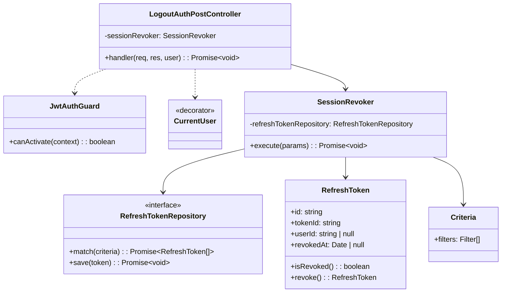

# Logout — Class Diagram

```mermaid
classDiagram
    class LogoutAuthPostController {
        -sessionRevoker: SessionRevoker
        +handler(req, res, user): Promise~void~
    }

    class JwtAuthGuard {
        +canActivate(context): boolean
    }

    class CurrentUser {
        <<decorator>>
    }

    class SessionRevoker {
        -refreshTokenRepository: RefreshTokenRepository
        +execute(params): Promise~void~
    }

    class RefreshToken {
        +id: string
        +tokenId: string
        +userId: string | null
        +revokedAt: Date | null
        +isRevoked(): boolean
        +revoke(): RefreshToken
    }

    class RefreshTokenRepository {
        <<interface>>
        +match(criteria): Promise~RefreshToken[]~
        +save(token): Promise~void~
    }

    class Criteria {
        +filters: Filter[]
    }

    LogoutAuthPostController --> SessionRevoker
    LogoutAuthPostController ..> JwtAuthGuard
    LogoutAuthPostController ..> CurrentUser
    SessionRevoker --> RefreshTokenRepository
    SessionRevoker --> RefreshToken
    SessionRevoker --> Criteria
```
