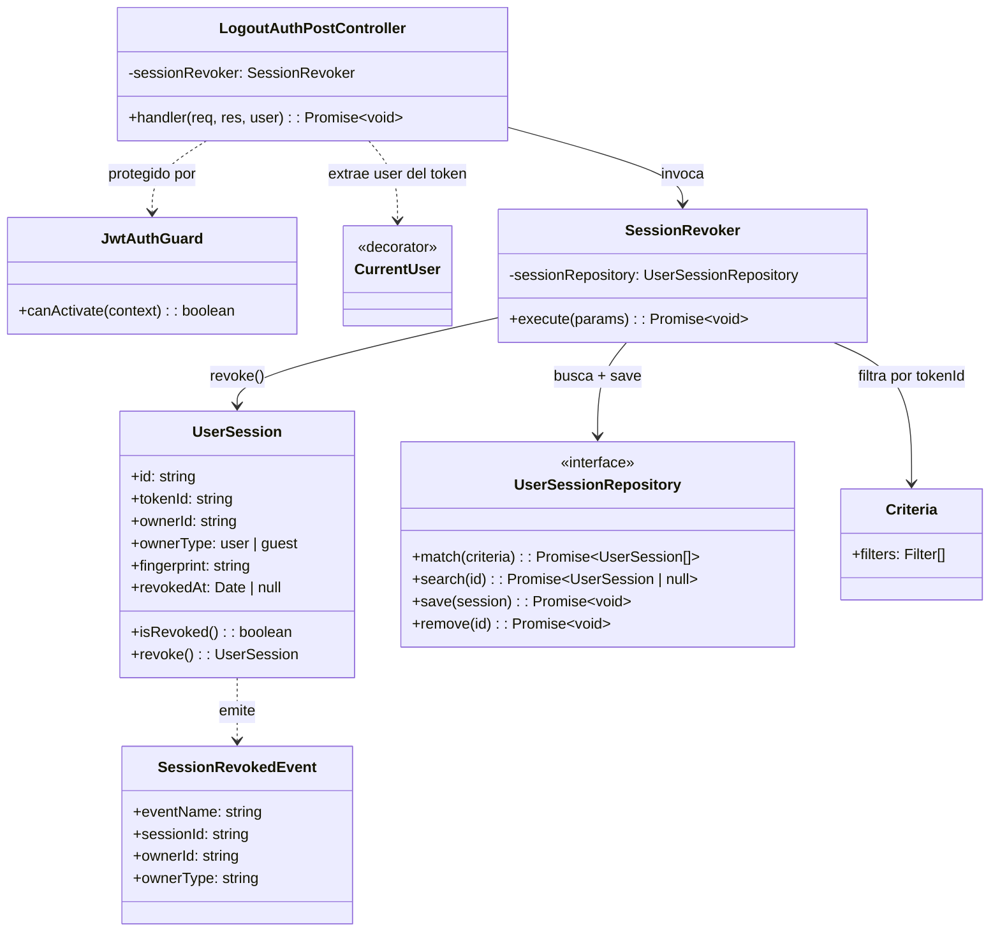

# Logout — Diagrama de Clases

> Artefactos involucrados en `POST /auth/logout`

```mermaid
classDiagram
    class LogoutAuthPostController {
        -sessionRevoker: SessionRevoker
        +handler(req, res, user): Promise~void~
    }

    class JwtAuthGuard {
        +canActivate(context): boolean
    }

    class CurrentUser {
        <<decorator>>
    }

    class SessionRevoker {
        -sessionRepository: UserSessionRepository
        +execute(params): Promise~void~
    }

    class UserSession {
        +id: string
        +tokenId: string
        +ownerId: string
        +ownerType: user | guest
        +fingerprint: string
        +revokedAt: Date | null
        +isRevoked(): boolean
        +revoke(): UserSession
    }

    class UserSessionRepository {
        <<interface>>
        +match(criteria): Promise~UserSession[]~
        +search(id): Promise~UserSession | null~
        +save(session): Promise~void~
        +remove(id): Promise~void~
    }

    class SessionRevokedEvent {
        +eventName: string
        +sessionId: string
        +ownerId: string
        +ownerType: string
    }

    class Criteria {
        +filters: Filter[]
    }

    LogoutAuthPostController --> SessionRevoker : invoca
    LogoutAuthPostController ..> JwtAuthGuard : protegido por
    LogoutAuthPostController ..> CurrentUser : extrae user del token
    SessionRevoker --> UserSessionRepository : busca + save
    SessionRevoker --> UserSession : revoke()
    SessionRevoker --> Criteria : filtra por tokenId
    UserSession ..> SessionRevokedEvent : emite
```
