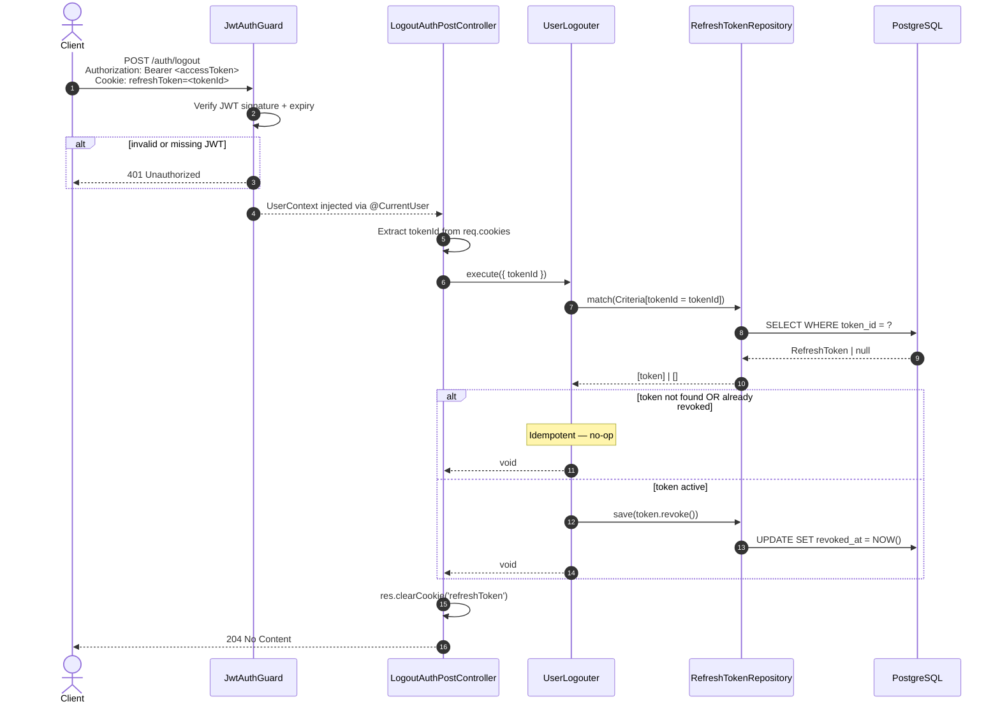

# Logout — Sequence Diagram

Flujo de cierre de sesión. Requiere JWT válido en `Authorization: Bearer`. Revoca el refresh token
del dispositivo actual y limpia la cookie. Es **idempotente**: si el token ya estaba revocado, no falla.

