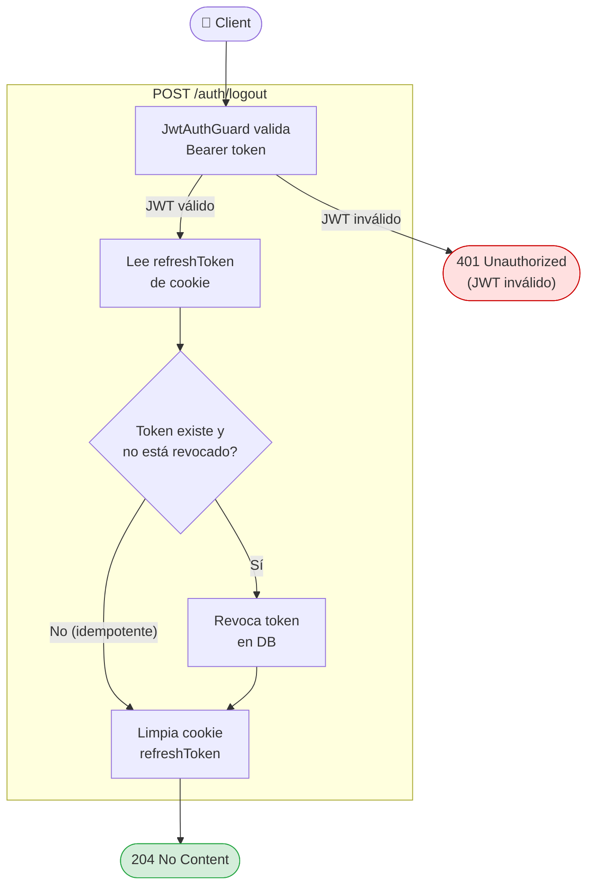

# Logout — Use Case Diagram

## Reglas de negocio

| Regla | Descripción |
|---|---|
| Requiere autenticación | Solo usuarios con JWT válido pueden llamar a este endpoint |
| Idempotencia | Si el token ya estaba revocado o no existe, responde 204 sin error |
| Scope del logout | Solo revoca el token del dispositivo actual (no sesión global) |
| Cookie limpiada | `clearCookie` con mismas opciones que al crear (httpOnly, sameSite) |
