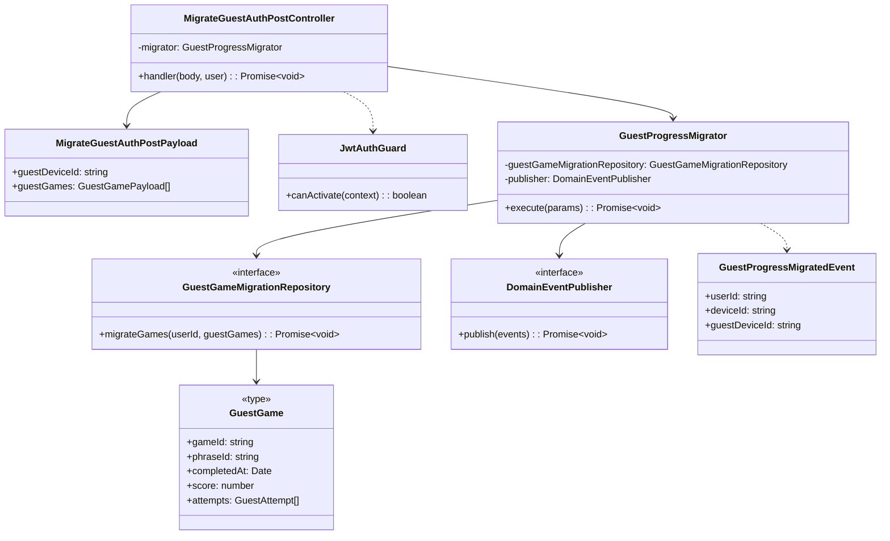

# Migrate Guest — Class Diagram

```mermaid
classDiagram
    class MigrateGuestAuthPostController {
        -migrator: GuestProgressMigrator
        +handler(body, user): Promise~void~
    }

    class MigrateGuestAuthPostPayload {
        +guestDeviceId: string
        +guestGames: GuestGamePayload[]
    }

    class JwtAuthGuard {
        +canActivate(context): boolean
    }

    class GuestProgressMigrator {
        -guestGameMigrationRepository: GuestGameMigrationRepository
        -publisher: DomainEventPublisher
        +execute(params): Promise~void~
    }

    class GuestGameMigrationRepository {
        <<interface>>
        +migrateGames(userId, guestGames): Promise~void~
    }

    class GuestGame {
        <<type>>
        +gameId: string
        +phraseId: string
        +completedAt: Date
        +score: number
        +attempts: GuestAttempt[]
    }

    class DomainEventPublisher {
        <<interface>>
        +publish(events): Promise~void~
    }

    class GuestProgressMigratedEvent {
        +userId: string
        +deviceId: string
        +guestDeviceId: string
    }

    MigrateGuestAuthPostController --> GuestProgressMigrator
    MigrateGuestAuthPostController ..> JwtAuthGuard
    MigrateGuestAuthPostController --> MigrateGuestAuthPostPayload
    GuestProgressMigrator --> GuestGameMigrationRepository
    GuestProgressMigrator --> DomainEventPublisher
    GuestProgressMigrator ..> GuestProgressMigratedEvent
    GuestGameMigrationRepository --> GuestGame
```
