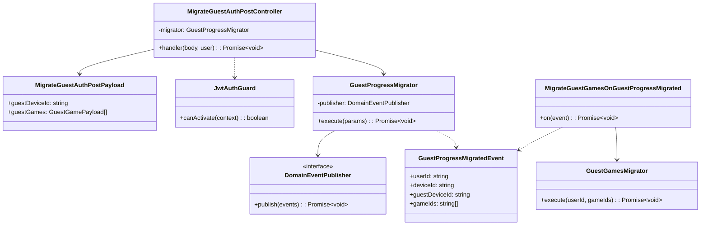

# Migrate Guest — Class Diagram

```mermaid
classDiagram
    class MigrateGuestAuthPostController {
        -migrator: GuestProgressMigrator
        +handler(body, user): Promise~void~
    }

    class MigrateGuestAuthPostPayload {
        +guestDeviceId: string
        +guestGames: GuestGamePayload[]
    }

    class JwtAuthGuard {
        +canActivate(context): boolean
    }

    class GuestProgressMigrator {
        -publisher: DomainEventPublisher
        +execute(params): Promise~void~
    }

    class DomainEventPublisher {
        <<interface>>
        +publish(events): Promise~void~
    }

    class GuestProgressMigratedEvent {
        +userId: string
        +deviceId: string
        +guestDeviceId: string
        +gameIds: string[]
    }

    class MigrateGuestGamesOnGuestProgressMigrated {
        +on(event): Promise~void~
    }

    class GuestGamesMigrator {
        +execute(userId, gameIds): Promise~void~
    }

    MigrateGuestAuthPostController --> GuestProgressMigrator
    MigrateGuestAuthPostController ..> JwtAuthGuard
    MigrateGuestAuthPostController --> MigrateGuestAuthPostPayload
    GuestProgressMigrator --> DomainEventPublisher
    GuestProgressMigrator ..> GuestProgressMigratedEvent
    MigrateGuestGamesOnGuestProgressMigrated ..> GuestProgressMigratedEvent
    MigrateGuestGamesOnGuestProgressMigrated --> GuestGamesMigrator
```
