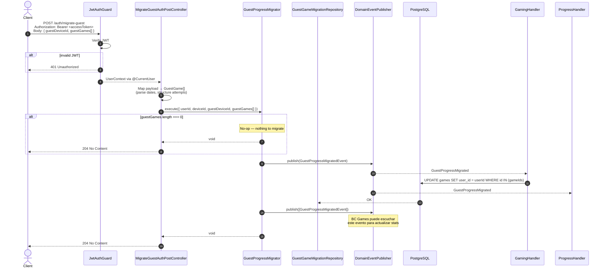

# Migrate Guest — Sequence Diagram

Flujo de migración del progreso de un usuario guest a su cuenta registrada.
Requiere JWT válido. El cliente envía los datos de progreso del guest (juegos completados)
y el servidor los persiste bajo el userId autenticado, publicando un domain event
para que otros BCs puedan reaccionar.

