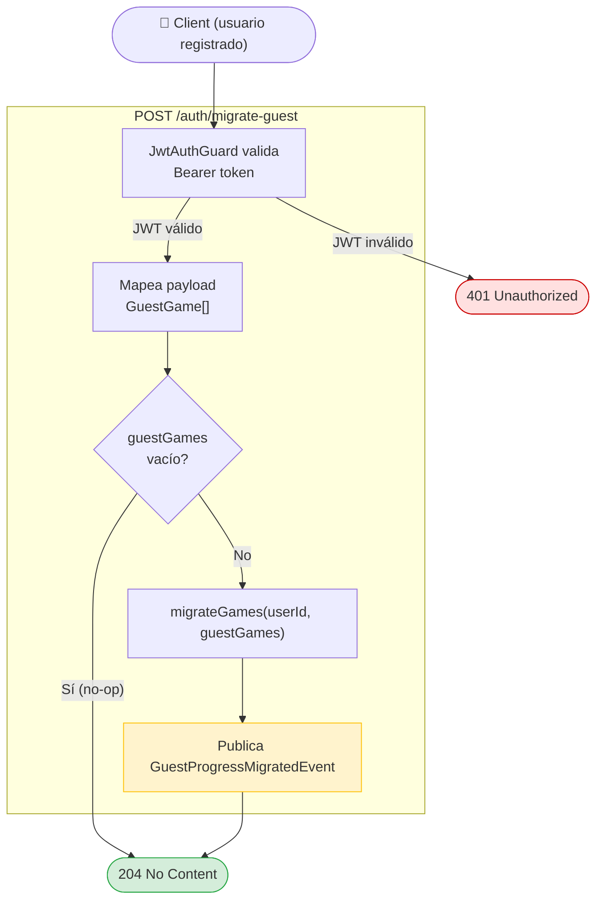

# Migrate Guest — Use Case Diagram

## Reglas de negocio

| Regla | Descripción |
|---|---|
| Requiere autenticación | Solo usuarios registrados con JWT válido pueden migrar progreso |
| No-op en vacío | Si `guestGames` está vacío, responde 204 sin tocar la DB |
| `userId` del JWT | La identidad destino siempre viene del token, no del body |
| `guestDeviceId` del body | Identifica el dispositivo guest del que provienen los juegos |
| Evento de dominio | `GuestProgressMigratedEvent` notifica a BC Games para actualizar ranking/stats |
| Idempotencia | Si los juegos ya fueron migrados, la lógica está en el repositorio (upsert) |
