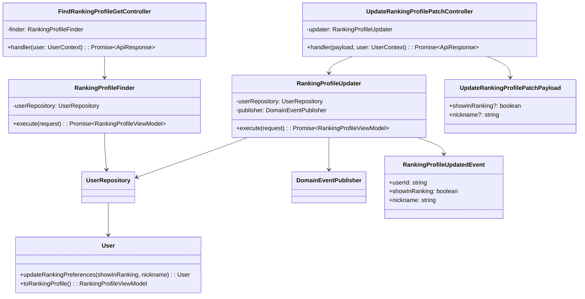

# Ranking Profile — Diagrama de Clases

```mermaid
classDiagram
    class FindRankingProfileGetController {
        -finder: RankingProfileFinder
        +handler(user: UserContext): Promise~ApiResponse~
    }

    class UpdateRankingProfilePatchController {
        -updater: RankingProfileUpdater
        +handler(payload, user: UserContext): Promise~ApiResponse~
    }

    class UpdateRankingProfilePatchPayload {
        +showInRanking?: boolean
        +nickname?: string
    }

    class RankingProfileFinder {
        -userRepository: UserRepository
        +execute(request): Promise~RankingProfileViewModel~
    }

    class RankingProfileUpdater {
        -userRepository: UserRepository
        -publisher: DomainEventPublisher
        +execute(request): Promise~RankingProfileViewModel~
    }

    class User {
        +updateRankingPreferences(showInRanking, nickname): User
        +toRankingProfile(): RankingProfileViewModel
    }

    class RankingProfileUpdatedEvent {
        +userId: string
        +showInRanking: boolean
        +nickname: string
    }

    FindRankingProfileGetController --> RankingProfileFinder
    UpdateRankingProfilePatchController --> RankingProfileUpdater
    UpdateRankingProfilePatchController --> UpdateRankingProfilePatchPayload
    RankingProfileFinder --> UserRepository
    RankingProfileUpdater --> UserRepository
    RankingProfileUpdater --> DomainEventPublisher
    RankingProfileUpdater --> RankingProfileUpdatedEvent
    UserRepository --> User
```
