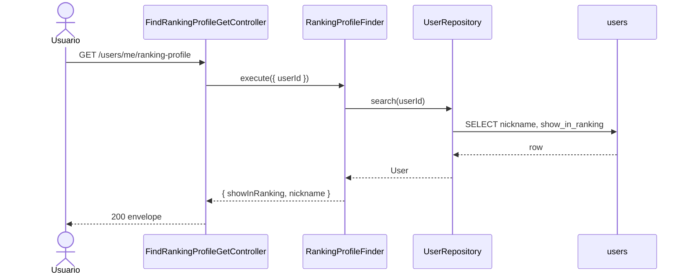
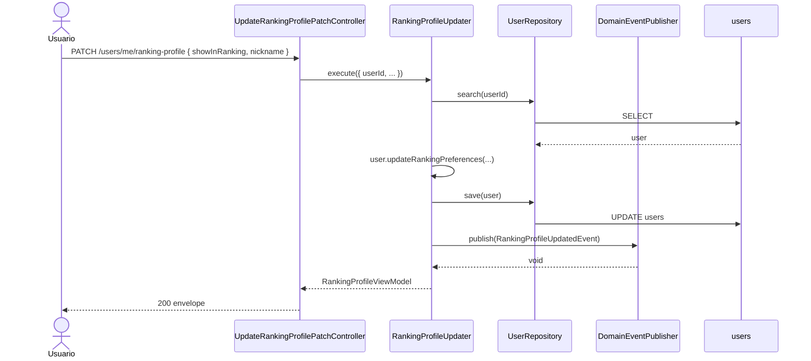

# Ranking Profile — Diagrama de Secuencia

## GET `/users/me/ranking-profile`

## PATCH `/users/me/ranking-profile`

## Downstream

`RankingProfileUpdatedEvent` → `RankingUpdaterOnRankingProfileUpdated` → `SyncRankingProfile` (Ranking BC).
