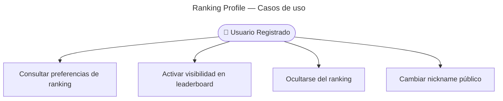

# Ranking Profile — Casos de Uso

## Reglas de negocio

| Regla | Detalle |
|-------|---------|
| Auth | JWT obligatorio |
| GET | Devuelve `{ showInRanking, nickname }` del agregado User |
| PATCH | Al menos un campo opcional; validación con class-validator |
| Evento | Cambio publica `RankingProfileUpdated` → sync en Ranking BC |
| Opt-out | Ranking elimina filas existentes del usuario |
| Opt-in | Ranking renombra filas + backfill histórico |
| Envelope | Query responses usan `{ data, meta }` |
