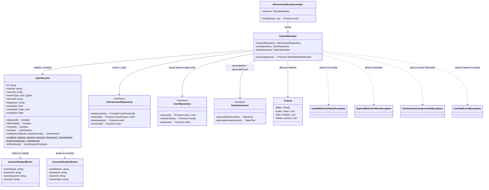

# Refresh — Diagrama de Clases

> Artefactos involucrados en `POST /auth/refresh`

```mermaid
classDiagram
    class RefreshAuthPostController {
        -refresher: TokenRefresher
        +handler(req, res): Promise~void~
    }

    class TokenRefresher {
        -sessionRepository: UserSessionRepository
        -userRepository: UserRepository
        -tokenGenerator: TokenGenerator
        +execute(params): Promise~TokenRefresherResult~
    }

    class UserSession {
        +id: string
        +tokenId: string
        +ownerId: string
        +ownerType: user | guest
        +deviceId: string
        +fingerprint: string
        +expiresAt: Date
        +revokedAt: Date | null
        +createdAt: Date
        +isExpired(): boolean
        +isRevoked(): boolean
        +isGuest(): boolean
        +revoke(): UserSession
        +rotate(newTokenId, newSessionId): UserSession
        +create(id, tokenId, ownerId, deviceId, fingerprint)$ UserSession
        +fromPrimitives(p)$ UserSession
        +toPrimitives(): UserSessionPrimitives
    }

    class UserSessionRepository {
        <<interface>>
        +match(criteria): Promise~UserSession[]~
        +search(id): Promise~UserSession | null~
        +save(session): Promise~void~
        +remove(id): Promise~void~
    }

    class UserRepository {
        <<interface>>
        +search(id): Promise~User | null~
        +match(criteria): Promise~User[]~
        +save(user): Promise~void~
    }

    class TokenGenerator {
        <<interface>>
        +generatePair(context): TokenPair
        +generateGuest(context): TokenPair
    }

    class SessionRotatedEvent {
        +eventName: string
        +sessionId: string
        +newSessionId: string
        +ownerId: string
    }

    class SessionRevokedEvent {
        +eventName: string
        +sessionId: string
        +ownerId: string
        +ownerType: string
    }

    class Criteria {
        +filters: Filter[]
        +order: Order | null
        +limit: number | null
        +offset: number | null
    }

    class InvalidRefreshTokenException
    class ExpiredRefreshTokenException
    class UserSessionCompromisedException
    class UserNotFoundException

    RefreshAuthPostController --> TokenRefresher : invoca
    TokenRefresher --> UserSessionRepository : busca + save
    TokenRefresher --> UserRepository : busca owner si type=user
    TokenRefresher --> TokenGenerator : generatePair / generateGuest
    TokenRefresher --> UserSession : rotate() / revoke()
    TokenRefresher --> Criteria : filtra por tokenId
    UserSession ..> SessionRotatedEvent : emite en rotate()
    UserSession ..> SessionRevokedEvent : emite en revoke()
    TokenRefresher ..> InvalidRefreshTokenException : lanza si no existe
    TokenRefresher ..> ExpiredRefreshTokenException : lanza si expirado
    TokenRefresher ..> UserSessionCompromisedException : lanza si reuse detectado
    TokenRefresher ..> UserNotFoundException : lanza si owner no existe
```
