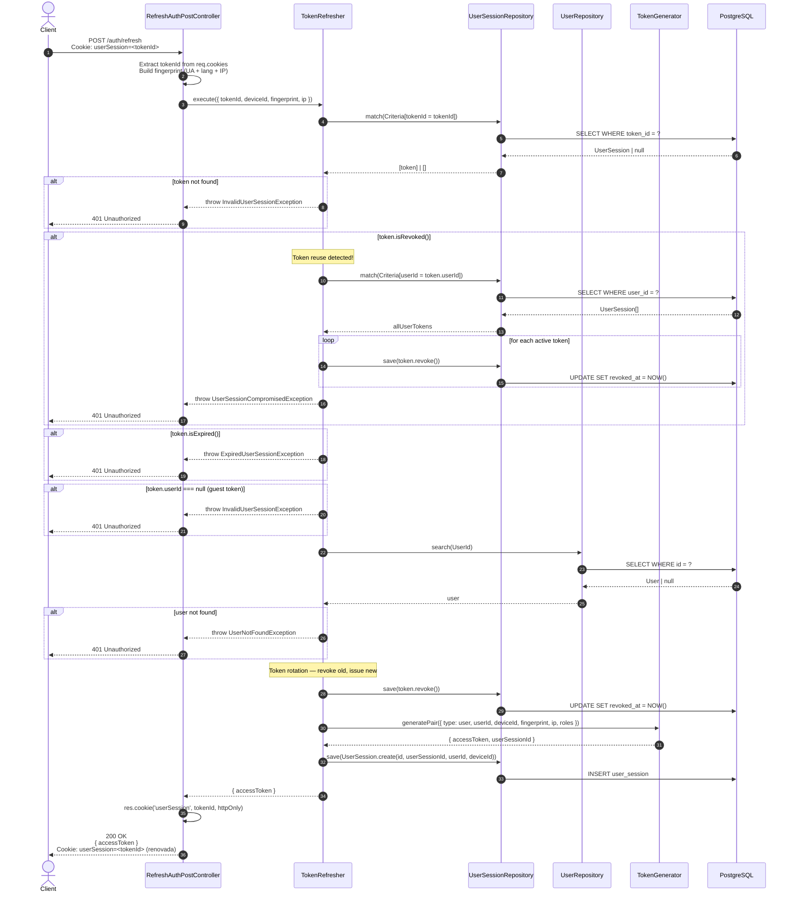

# Refresh — Sequence Diagram

Flujo de renovación de access token usando el refresh token almacenado en cookie HTTP-only.

Incluye detección de **token reuse** (reuse detection attack): si el token presentado ya fue revocado,
se revocan TODOS los tokens activos del usuario.

